# (PART) Objects and Methods {-}

```{r, include = FALSE}
source("common.R")
```


# Objects and Methods Overview


To start your journey in mastering R, the following six chapters will help you learn the foundational components of R. I expect that you've already seen many of these pieces before, but you probably have not studied them deeply. To help check your existing knowledge, each chapter starts with a quiz; if you get all the questions right, feel free to skip to the next chapter!

# Image

## Image Overview {-}

As mentioned in the [Get Started]() doc, raster data are represented as Image objects in Earth Engine. Images are composed of one or more bands and each band has its own name, data type, scale, mask and projection. Each image has metadata stored as a set of properties.

### `ee$Image` constructor {-}

Images can be loaded by pasting an Earth Engine asset ID into the `ee$Image` constructor. You can find image IDs in the [data catalog](https://developers.google.com/earth-engine/datasets). For example, to load [JAXA's ALOS DSM](https://developers.google.com/earth-engine/datasets/catalog/JAXA_ALOS_AW3D30_V3_2):

```{r, eval=FALSE}
loadedImage <- ee$Image('JAXA/ALOS/AW3D30/V2_2')
```

Note that finding an image through the Code Editor search tool is equivalent. When you import the asset, the image construction code is written for you in the imports section of the Code Editor. You can also use a personal asset ID as shown in this doc.

### Get an `ee$Image` from an `ee$ImageCollection` {-}

The standard way to get an image out of a collection is to filter the collection, with filters in order of decreasing specificity. For example, to get an image out of the [Sentinel-2 surface reflectance collection](https://developers.google.com/earth-engine/datasets/catalog/COPERNICUS_S2_SR):

```{r, eval=FALSE}
first <- ee$ImageCollection('COPERNICUS/S2_SR')$
  filterBounds(ee$Geometry$Point(-70.48, 43.3631))$
  filterDate('2019-01-01', '2019-12-31')$
  sort('CLOUDY_PIXEL_PERCENTAGE')$
  first()
vizParams <- list(bands = c('B4', 'B3', 'B2'),
                  min = 0, 
                  max = 2000)
Map$centerObject(first, 11);
Map$addLayer(first, vizParams, 'first')
```

Note that the `sort` is *after* the filters. Avoid sorting the entire collection.

### Images from Cloud GeoTIFFs {-}

You can use `ee$Image$loadGeoTIFF()` to load images from Cloud Optimized GeoTIFFs in Google Cloud Storage. For example, the [public Landsat dataset](https://console.cloud.google.com/marketplace/details/usgs-public-data/landast) hosted in Google Cloud contains [this GeoTIFF](https://console.cloud.google.com/storage/browser/_details/gcp-public-data-landsat/LC08/01/001/002/LC08_L1GT_001002_20160817_20170322_01_T2/LC08_L1GT_001002_20160817_20170322_01_T2_B5.TIF), corresponding to band 5 from a Landsat 8 scene. You can load this image from Cloud Storage using `ee$Image$loadGeoTIFF()`:

```{r, eval=FALSE}
uri <- 'gs://gcp-public-data-landsat/LC08/01/001/002/' +
    'LC08_L1GT_001002_20160817_20170322_01_T2/' +
    'LC08_L1GT_001002_20160817_20170322_01_T2_B5.TIF'
cloudImage <- ee$Image$loadGeoTIFF(uri)
print(cloudImage)
```

Note that if you want to reload a Cloud Optimized GeoTIFF that you [export from Earth Engine to Cloud Storage](), when you do the export, set `cloudOptimized` to **true** as described [here]().

### Constant images {-}

In addition to loading images by ID, you can also create images from constants, lists or other suitable Earth Engine objects. The following illustrates methods for creating images, getting band subsets, and manipulating bands:

```{r, eval=FALSE}
# Create a constant image.
image1 <- ee$Image(1)
print(image1)

# Concatenate two images into one multi-band image.
image2 <- ee$Image(2)
image3 <- ee$Image$cat(c(image1, image2))
print(image3)

# Create a multi-band image from a list of constants.
multiband <- ee$Image(c(1, 2, 3))
print(multiband)

# Select and (optionally) rename bands.
renamed = multiband$select(
  c('constant', 'constant_1', 'constant_2'), ## old names
  c('band1', 'band2', 'band3')               ## new names
)
print(renamed)

# Add bands to an image.
image4 <- image3$addBands(ee$Image(42));
print(image4)
```


## Image Visualization {-}

The are a number of `ee$Image` methods that produce RGB visual representations of image data, for example: `visualize()`, `getThumbURL()`, `getMap()`, `getMapId()` (used in Colab Folium map display) and, `Map$addLayer()` (used in Code Editor map display, not available for Python). By default these methods assign the first three bands to red, green and blue, respectively. The default stretch is based on the type of data in the bands (e.g. floats are stretched in [0, 1], 16-bit data are stretched to the full range of possible values), which may or may not be suitable. To achieve desired visualization effects, you can provide visualization parameters:

| Parameter| Description | Type | 
|--|:--|--|
| *bands* |Comma-delimited list of three band names to be mapped to RGB| list    |
| *min*  | Value(s) to map to 0       | number or list of three numbers, one for each band    | 
| *max*   | Value(s) to map to 255 | number or list of three numbers, one for each band       | 
| *gain*  | Value(s) by which to multiply each pixel value|number or list of three numbers, one for each band | 
| *bias*  | Value(s) to add to each DN  | number or list of three numbers, one for each band  | 
| *gamma* | Gamma correction factor(s)  |number or list of three numbers, one for each band   | 
| *palette* | 	List of CSS-style color strings (single-band images only)  | comma-separated list of hex strings|
| *opacity* | The opacity of the layer (0.0 is fully transparent and 1.0 is fully opaque)| number |
| *format*  | Either "jpg" or "png"  | string |


### RGB composites {-}    

The following illustrates the use of parameters to style a Landsat 8 image as a false-color composite:

```{r, eval=FALSE}
# Load an image.
image <- ee$Image('LANDSAT/LC08/C01/T1_TOA/LC08_044034_20140318')

# Define the visualization parameters.
vizParams <- list(bands = c('B5', 'B4', 'B3'),
  min = 0,
  max = 0.5,
  gamma = c(0.95, 1.1, 1)
)
# Center the map and display the image.
Map$setCenter(-122.1899, 37.5010, 10); ## San Francisco Bay
Map$addLayer(image, vizParams, 'false color composite')
```

In this example, band `'B5'` is assigned to red, `'B4'` is assigned to green, and `'B3'` is assigned to blue.
<center>
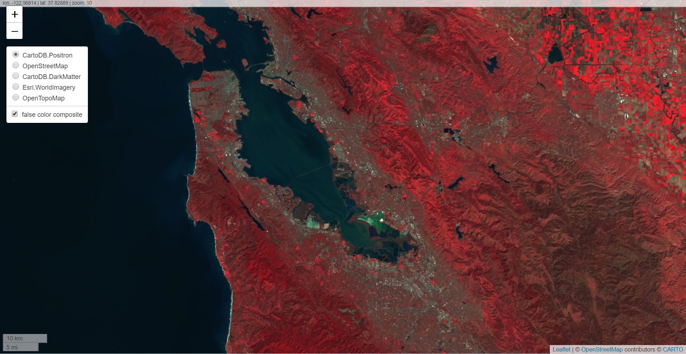{width=670px}

</center>


### Color palettes {-}

To display a single band of an image in color, set the palette parameter with a color ramp represented by a list of CSS-style color strings. (See this reference for more information). The following example illustrates how to use colors from cyan ('00FFFF') to blue ('0000FF') to render a Normalized Difference Water Index (NDWI) image:

```{r, eval=FALSE}
# Load an image.
image <- ee$Image('LANDSAT/LC08/C01/T1_TOA/LC08_044034_20140318')

# Create an NDWI image, define visualization parameters and display.
ndwi <- image$normalizedDifference(c('B3', 'B5'))
ndwiViz <- list(
  min = 0.5, 
  max = 1, 
  palette = c('00FFFF', '0000FF')
)
Map$addLayer(ndwi, ndwiViz, 'NDWI')
```

In this example, note that the min and max parameters indicate the range of pixel values to which the palette should be applied. Intermediate values are linearly stretched.

<center>
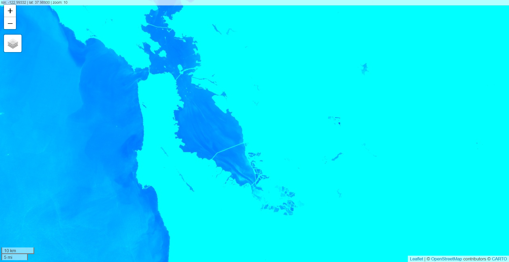{width=670px}

</center>


### Masking {-}

You can use `image$updateMask()` to set the opacity of individual pixels based on where pixels in a mask image are non-zero. Pixels equal to zero in the mask are excluded from computations and the opacity is set to 0 for display. The following example uses an NDWI threshold (see the [Relational Operations section]() for information on thresholds) to update the mask on the NDWI layer created previously:

```{r, eval=FALSE}
# Mask the non-watery parts of the image, where NDWI < 0.4.
ndwiMasked <- ndwi$updateMask(ndwi$gte(0.4))
Map$addLayer(ndwiMasked, ndwiViz, 'NDWI masked')
```

### Visualization images {-}

Use the `image.visualize()` method to convert an image into an 8-bit RGB image for display or export. For example, to convert the false-color composite and NDWI to 3-band display images, use:

```{r, eval=FALSE}
# Create visualization layers.
imageRGB <- image$visualize(list(
  bands = c('B5', 'B4', 'B3'), 
  max = 0.5
))

ndwiRGB <- ndwiMasked$visualize(list(
  min = 0.5,
  max = 1,
  palette = c('00FFFF', '0000FF'))
)
```

### Mosaicking {-}

You can use masking and `imageCollection.mosaic()` (see the Mosaicking section for information on mosaicking) to achieve various cartographic effects. The `mosaic()` method renders layers in the output image according to their order in the input collection. The following example uses `mosaic()` to combine the masked NDWI and the false color composite and obtain a new visualization:

```{r, eval=FALSE}
# Mosaic the visualization layers and display (or export).
mosaic <- ee$ImageCollection(list(imageRGB, ndwiRGB))$
  mosaic()
Map$addLayer(mosaic, {}, 'mosaic')
```

In this example, observe that a list of the two visualization images is provided to the `ImageCollection` constructor. The order of the list determines the order in which the images are rendered on the map.
<center>
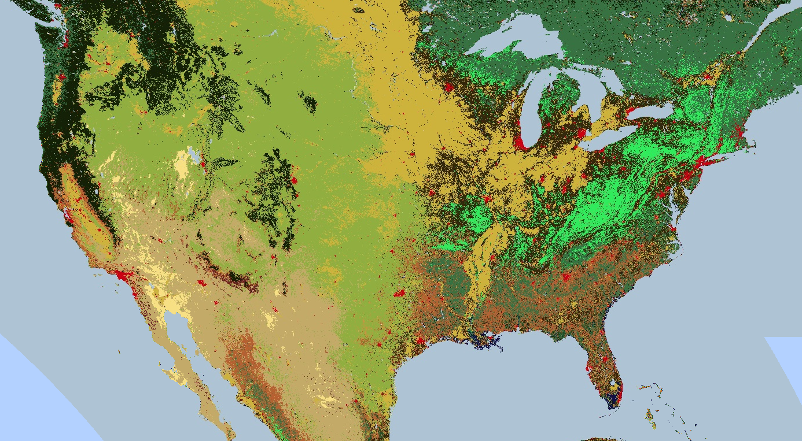{width=670px}

</center>


### Clipping {-}

The `image$clip()` method is useful for achieving cartographic effects. The following example clips the mosaic created previously to an arbitrary buffer zone around the city of San Francisco:

```{r, eval=FALSE}
# Create a circle by drawing a 20000 meter buffer around a point.
roi <- ee$Geometry$Point(-122.4481, 37.7599)$buffer(20000);

# Display a clipped version of the mosaic.
Map$addLayer(mosaic$clip(roi))
```

In the previous example, note that the coordinates are provided to the `Geometry` constructor and the buffer length is specified as 20,000 meters. Learn more about geometries on the [Geometries page]().
<center>
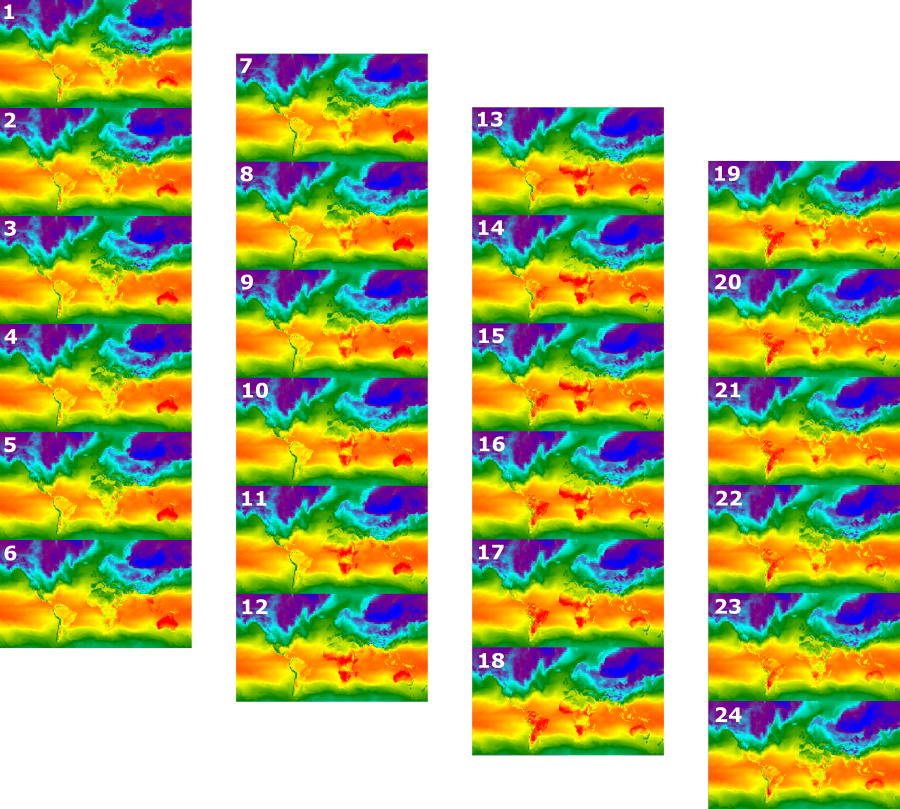{width=670px}

</center>


### Rendering categorical maps {-}

Palettes are also useful for rendering discrete valued maps, for example a land cover map. In the case of multiple classes, use the palette to supply a different color for each class. (The `image$remap()` method may be useful in this context, to convert arbitrary labels to consecutive integers). The following example uses a palette to render land cover categories:

```{r, eval=FALSE}
# Load 2012 MODIS land cover and select the IGBP classification.
cover <- ee$Image('MODIS/051/MCD12Q1/2012_01_01')$
  select('Land_Cover_Type_1')

# Define a palette for the 18 distinct land cover classes.
igbpPalette <- list(
  'aec3d4', ## water
  '152106', '225129', '369b47', '30eb5b', '387242', ## forest
  '6a2325', 'c3aa69', 'b76031', 'd9903d', '91af40',  ## shrub, grass
  '111149', ## wetlands
  'cdb33b', ## croplands
  'cc0013', ## urban
  '33280d', ## crop mosaic
  'd7cdcc', ## snow and ice
  'f7e084', ## barren
  '6f6f6f'  ## tundra
)

# Specify the min and max labels and the color palette matching the labels.
Map$setCenter(-99.229, 40.413, 5);
Map$addLayer(cover,
             {min: 0, max: 17, palette: igbpPalette},
             'IGBP classification');
```
<center>
{width=670px}

</center>


### Styled Layer Descriptors {-}

You can use a Styled Layer Descriptor ([SLD]()) to render imagery for display. Provide `image$sldStyle()` with an XML description of the symbolization and coloring of the image, specifically the `RasterSymbolizer` element. Learn more about the `RasterSymbolizer` element [here](). For example, to render the land cover map described in the Rendering categorical maps section with an SLD, use:

```{r, eval=FALSE}
cover <- ee$Image('MODIS/051/MCD12Q1/2012_01_01')$select('Land_Cover_Type_1')

# Define an SLD style of discrete intervals to apply to the image.
sld_intervals <-
'<RasterSymbolizer>' +
  '<ColorMap type="intervals" extended="false">' +
    '<ColorMapEntry color="#aec3d4" quantity="0" label="Water"/>' +
    '<ColorMapEntry color="#152106" quantity="1" label="Evergreen Needleleaf Forest"/>' +
    '<ColorMapEntry color="#225129" quantity="2" label="Evergreen Broadleaf Forest"/>' +
    '<ColorMapEntry color="#369b47" quantity="3" label="Deciduous Needleleaf Forest"/>' +
    '<ColorMapEntry color="#30eb5b" quantity="4" label="Deciduous Broadleaf Forest"/>' +
    '<ColorMapEntry color="#387242" quantity="5" label="Mixed Deciduous Forest"/>' +
    '<ColorMapEntry color="#6a2325" quantity="6" label="Closed Shrubland"/>' +
    '<ColorMapEntry color="#c3aa69" quantity="7" label="Open Shrubland"/>' +
    '<ColorMapEntry color="#b76031" quantity="8" label="Woody Savanna"/>' +
    '<ColorMapEntry color="#d9903d" quantity="9" label="Savanna"/>' +
    '<ColorMapEntry color="#91af40" quantity="10" label="Grassland"/>' +
    '<ColorMapEntry color="#111149" quantity="11" label="Permanent Wetland"/>' +
    '<ColorMapEntry color="#cdb33b" quantity="12" label="Cropland"/>' +
    '<ColorMapEntry color="#cc0013" quantity="13" label="Urban"/>' +
    '<ColorMapEntry color="#33280d" quantity="14" label="Crop, Natural Veg. Mosaic"/>' +
    '<ColorMapEntry color="#d7cdcc" quantity="15" label="Permanent Snow, Ice"/>' +
    '<ColorMapEntry color="#f7e084" quantity="16" label="Barren, Desert"/>' +
    '<ColorMapEntry color="#6f6f6f" quantity="17" label="Tundra"/>' +
  '</ColorMap>' +
'</RasterSymbolizer>'

Map$addLayer(cover$sldStyle(sld_intervals), {}, 'IGBP classification styled');
```

To create a visualization image with a color ramp, set the type of the ColorMap to 'ramp'. The following example compares the 'interval' and 'ramp' types for rendering a DEM:

```{r, eval=FALSE}
# Load SRTM Digital Elevation Model data.
image <- ee$Image('CGIAR/SRTM90_V4')

# Define an SLD style of discrete intervals to apply to the image.
var sld_intervals <-
  '<RasterSymbolizer>' +
    '<ColorMap type="intervals" extended="false" >' +
      '<ColorMapEntry color="#0000ff" quantity="0" label="0"/>' +
      '<ColorMapEntry color="#00ff00" quantity="100" label="1-100" />' +
      '<ColorMapEntry color="#007f30" quantity="200" label="110-200" />' +
      '<ColorMapEntry color="#30b855" quantity="300" label="210-300" />' +
      '<ColorMapEntry color="#ff0000" quantity="400" label="310-400" />' +
      '<ColorMapEntry color="#ffff00" quantity="1000" label="410-1000" />' +
    '</ColorMap>' +
  '</RasterSymbolizer>'

# Define an sld style color ramp to apply to the image.
sld_ramp <-
  '<RasterSymbolizer>' +
    '<ColorMap type="ramp" extended="false" >' +
      '<ColorMapEntry color="#0000ff" quantity="0" label="0"/>' +
      '<ColorMapEntry color="#00ff00" quantity="100" label="100" />' +
      '<ColorMapEntry color="#007f30" quantity="200" label="200" />' +
      '<ColorMapEntry color="#30b855" quantity="300" label="300" />' +
      '<ColorMapEntry color="#ff0000" quantity="400" label="400" />' +
      '<ColorMapEntry color="#ffff00" quantity="500" label="500" />' +
    '</ColorMap>' +
  '</RasterSymbolizer>'

# Add the image to the map using both the color ramp and interval schemes.
Map$setCenter(-76.8054, 42.0289, 8)
Map$addLayer(image$sldStyle(sld_intervals), {}, 'SLD intervals')
Map$addLayer(image$sldStyle(sld_ramp), {}, 'SLD ramp')
```

SLDs are also useful for stretching pixel values to improve visualizations of continuous data. For example, the following code compares the results of an arbitrary linear stretch with a min-max 'Normalization' and a 'Histogram' equalization:

```{r, eval=FALSE}
# Load a Landsat 8 raw image.
image = ee$Image('LANDSAT/LC08/C01/T1/LC08_044034_20140318')

# Define a RasterSymbolizer element with '_enhance_' for a placeholder.
template_sld <-
  '<RasterSymbolizer>' +
    '<ContrastEnhancement><_enhance_/></ContrastEnhancement>' +
    '<ChannelSelection>' +
      '<RedChannel>' +
        '<SourceChannelName>B5</SourceChannelName>' +
      '</RedChannel>' +
      '<GreenChannel>' +
        '<SourceChannelName>B4</SourceChannelName>' +
      '</GreenChannel>' +
      '<BlueChannel>' +
        '<SourceChannelName>B3</SourceChannelName>' +
      '</BlueChannel>' +
    '</ChannelSelection>' +
  '</RasterSymbolizer>'

# Get SLDs with different enhancements.
equalize_sld <- template_sld.replace('_enhance_', 'Histogram')
normalize_sld <- template_sld.replace('_enhance_', 'Normalize')

# Display the results.
Map$centerObject(image, 10)
Map$addLayer(image, {bands: ['B5', 'B4', 'B3'], min: 0, max: 15000}, 'Linear')
Map$addLayer(image.sldStyle(equalize_sld), {}, 'Equalized')
Map$addLayer(image.sldStyle(normalize_sld), {}, 'Normalized')
```

Points of note in reference to using SLDs in Earth Engine:

- OGC SLD 1.0 and OGC SE 1.1 are supported.
- The XML document passed in can be complete, or just the RasterSymbolizer element and down.
- Bands may be selected by their Earth Engine names or index ('1', '2', ...).
- The Histogram and Normalize contrast stretch mechanisms are not supported for floating point imagery.
- Opacity is only taken into account when it is 0.0 (transparent). Non-zero opacity values are treated as completely opaque.
- The OverlapBehavior definition is currently ignored.
- The ShadedRelief mechanism is not currently supported.
- The ImageOutline mechanism is not currently supported.
- The Geometry element is ignored.
- The output image will have histogram_bandname metadata if histogram equalization or normalization is requested.

### Thumbnail images {-}

Use the `ee$Image.getThumbURL()` method to generate a PNG or JPEG thumbnail image for an `ee$Image` object. Printing the outcome of an expression ending with a call to `getThumbURL()` results in a URL being printed. Visiting the URL sets Earth Engine servers to work on generating the requested thumbnail on-the-fly. The image is displayed in a browser when processing completes. It can be downloaded by selecting appropriate options from the image's right-click context menu.
 
 -**Note**: *The authorization token to process the thumbnail lasts 2 hours. Until it expires, anyone  with the authorization token can generate the image.*
<center>
{width=670px}

</center>


The `getThumbURL()` method includes parameters, described in the visualization parameters table above. Additionally, it takes optional `dimensions`, `region`, and `crs` arguments that control the spatial extent, size, and display projection of the thumbnail.

| Parameter| Description | Type | 
|--|:--|--|
| *dimensions* |Thumbnail dimensions in pixel units. If a single integer is provided, it defines the size of the image's larger aspect dimension and scales the smaller dimension proportionally. Defaults to 512 pixels for the larger image aspect dimension.| A single integer or string in the format: 'WIDTHxHEIGHT'    |
| *region*  | The geospatial region of the image to render. The whole image by default, or the bounds of a provided geometry.|GeoJSON or a 2-D list of at least three point coordinates that define a linear ring | 
| *crs*   | The target projection e.g. 'EPSG:3857'. Defaults to WGS84 ('EPSG:4326').|   String  |
| *format*  | 	Defines thumbnail format as either PNG or JPEG. The default PNG format is implemented as RGBA, where the alpha channel represents valid and invalid pixels, defined by the image's mask(). Invalid pixels are transparent. The optional JPEG format is implemented as RGB, where invalid image pixels are zero filled across RGB channels.|String; either 'png' or 'jpg'  |


*Caution*: **The *'WIDTHxHEIGHT'* dimensions argument can alter the original aspect ratio of the data or region extent.**


A single-band image will default to grayscale unless a `palette` argument is supplied. A multi-band image will default to RGB visualization of the first three bands, unless a `bands` argument is supplied. If only two bands are provided, the first band will map to red, the second to blue, and the green channel will be zero filled.

The following are a series of examples demonstrating various combinations of `getThumbURL()` parameter arguments. Click on the URLs printed when you run this script to view the thumbnails.

```{r, eval=FALSE}
# Fetch a digital elevation model.
image <- ee$Image('CGIAR/SRTM90_V4')

# Request a default thumbnail of the DEM with defined linear stretch.
# Set masked pixels (ocean) to 1000 so they map as gray.
thumbnail1 <- image$unmask(1000)$getThumbURL({
  'min': 0,
  'max': 3000,
  'dimensions': 500,
})
print('Default extent:', thumbnail1)

# Specify region by rectangle, define palette, set larger aspect dimension size.
thumbnail2 <- image$getThumbURL({
  'min': 0,
  'max': 3000,
  'palette': ['00A600','63C600','E6E600','E9BD3A','ECB176','EFC2B3','F2F2F2'],
  'dimensions': 500,
  'region': ee.Geometry.Rectangle([-84.6, -55.9, -32.9, 15.7]),
})
print('Rectangle region and palette:', thumbnail2);

# Specify region by a linear ring and set display CRS as Web Mercator.
thumbnail3 <- image.getThumbURL({
  'min': 0,
  'max': 3000,
  'palette': ['00A600','63C600','E6E600','E9BD3A','ECB176','EFC2B3','F2F2F2'],
  'region': ee.Geometry.LinearRing([[-84.6, 15.7], [-84.6, -55.9], [-32.9, -55.9]]),
  'dimensions': 500,
  'crs': 'EPSG:3857'
})
print('Linear ring region and specified crs', thumbnail3);
```

 
- **Note**: Thumbnail images are also available as UI elements (Code Editor only), see: [_ui.Thumbnail_]().*

- **Note**: `getThumbURL` is intended as a method for producing preview images you might include in presentations, websites, and social media posts. Its size limitation is 100,000,000 pixels and the browser can timeout for complicated requests. If you want a large image or have a complex process, see the [Exporting Data page]().

## Image Information and Metadata {-}

Print image objects to explore band names, projection information, properties, and other metadata. The following examples demonstrate printing the entire set of image metadata as well as requesting specific metadata elements programmatically.

### Getting metadata {-}

```{r, eval=FALSE}
# Load an image.
image <- ee$Image('LANDSAT/LC08/C01/T1/LC08_044034_20140318')

# Display all metadata.
print('All metadata:', image)

# Get information about the bands as a list.
var bandNames <- image$bandNames()
print('Band names:', bandNames)  ## ee$List of band names

# Get projection information from band 1.
b1proj <- image$select('B1')$projection()
print('Band 1 projection:', b1proj)  ## ee$Projection object

# Get scale (in meters) information from band 1.
b1scale <- image$select('B1')$projection()$nominalScale()
print('Band 1 scale:', b1scale)  ## ee$Number

## Note that different bands can have different projections and scale.
b8scale <- image$select('B8')$projection()$nominalScale()
print('Band 8 scale:', b8scale)  ## ee$Number

# Get a list of all metadata properties.
properties <- image$propertyNames()
print('Metadata properties:', properties)  ## ee$List of metadata properties

# Get a specific metadata property.
cloudiness <- image$get('CLOUD_COVER')
print('CLOUD_COVER:', cloudiness)  ## ee$Number

# Get version number (ingestion timestamp as microseconds since Unix epoch).
version <- image$get('system:version')
print('Version:', version)  ## ee$Number
print('Version (as ingestion date):',
      ee$Date(ee$Number(version)$divide(1000)))  ## ee$Date

# Get the timestamp and convert it to a date.
date <- ee$Date(image$get('system:time_start'))
print('Timestamp:', date)  ## ee$Date

```


## Mathematical Operations {-}

Image math can be performed using operators like `add()` and `subtract()`, but for complex computations with more than a couple of terms, the expression() function provides a good alternative. See the following sections for more information on [operators]() and [expressions]().

### Operators {-}

Math operators perform basic arithmetic operations on image bands. They take two inputs: either two images or one image and a constant term, which is interpreted as a single-band constant image with no masked pixels. Operations are performed per pixel for each band.

As a simple example, consider the task of calculating the Normalized Difference Vegetation Index (NDVI) using Landsat imagery, where `add()`, `subtract()`, and `divide()` operators are used:

```{r, eval=FALSE}
# Load a 5-year Landsat 7 composite 1999-2003.
landsat1999 <- ee$Image('LANDSAT/LE7_TOA_5YEAR/1999_2003')

# Compute NDVI.
ndvi1999 <- landsat1999$select('B4')$subtract(landsat1999$select('B3'))$
  divide(landsat1999$select('B4')$add(landsat1999$select('B3')))
```

**Note**: the normalized difference operation is available as a shortcut method: [_normalizedDifference()_]().

Only the intersection of unmasked pixels between the two inputs are considered and returned as unmasked, all else are masked. In general, if either input has only one band, then it is used against all the bands in the other input. If the inputs have the same number of bands, but not the same names, they're used pairwise in the natural order. The output bands are named for the longer of the two inputs, or if they're equal in length, in the first input's order. The type of the output pixels is the union of the input types.

The following example of multi-band image subtraction demonstrates how bands are matched automatically, resulting in a “change vector” for each pixel for each co-occurring band.

```{r, eval=FALSE}
# Load a 5-year Landsat 7 composite 2008-2012.
landsat2008 <- ee$Image('LANDSAT/LE7_TOA_5YEAR/2008_2012')

# Compute multi-band difference between the 2008-2012 composite and the
# previously loaded 1999-2003 composite.
diff <- landsat2008$subtract(landsat1999)
Map$addLayer(diff,
             {bands: ['B4', 'B3', 'B2'],
               min: -32, 
               max: 32}, 
             'difference')

# Compute the squared difference in each band.
squaredDifference <- diff$pow(2);
Map$addLayer(squaredDifference,
             {bands: ['B4', 'B3', 'B2'], max: 1000}, 'squared diff.')
```

In the second part of this example, the squared difference is computed using image.pow(2). For the complete list of mathematical operators handling basic arithmetic, trigonometry, exponentiation, rounding, casting, bitwise operations and more, see the [API documentation]().

### Expresions {-}

To implement more complex mathematical expressions, consider using image.expression(), which parses a text representation of a math operation. The following example uses expression() to compute the Enhanced Vegetation Index (EVI):

```{r, eval=FALSE}
# Load a Landsat 8 image.
image <- ee$Image('LANDSAT/LC08/C01/T1_TOA/LC08_044034_20140318')

# Compute the EVI using an expression.
evi <- image.expression(
    '2.5 * ((NIR - RED) / (NIR + 6 * RED - 7.5 * BLUE + 1))', {
      'NIR': image.select('B5'),
      'RED': image.select('B4'),
      'BLUE': image.select('B2')
})

Map$centerObject(image, 9)
Map$addLayer(evi, {min: -1, max: 1, palette: ['FF0000', '00FF00']})
```

Observe that the first argument to `expression()` is the textual representation of the math operation, the second argument is a dictionary where the keys are variable names used in the expression and the values are the image bands to which the variables should be mapped. Bands in the image may be referred to as `b("band name")` or `b(index)`, for example `b(0)`, instead of providing the dictionary. Bands can be defined from images other than the input when using the band map dictionary. Note that `expression()` uses "floor division", which discards the remainder and returns an integer when two integers are divided. For example `10 / 20 = 0`. To change this behavior, multiply one of the operands by `1.0: 10 * 1.0 / 20 = 0.5`. Only the intersection of unmasked pixels are considered and returned as unmasked when bands from more than one source image are evaluated. Supported expression operators are listed in the following table.

**Operators for expression()**

| Type | Symbol | Name | 
|--|:--|--|
| *Arithmetic*  |	+ - * / % **      | Add, Subtract, Multiply, Divide, Modulus, Exponent    |
| *Relational*  | 	== != < > <= >= | Equal, Not Equal, Less Than, Greater than, etc.       | 
| *Logical*     | && `||` ! ^       |                     And, Or, Not, Xor                 |
| *Ternary*     | 		? :           |                      If then else                     |

## Relational, Conditional, and Boolean Operations {-}

`ee$Image` objects have a set of relational, conditional, and boolean methods for constructing decision-making expressions. The results of these methods are useful for limiting analysis to certain pixels or regions through masking, developing classified maps, and value reassignment.

### Relational and boolean operators {-}

- **Relational** methods include:
`eq()`, `gt()`, `gte()`, `lt()`, and `lte()`.

- **Boolean** methods include:
`and()`,`or()`, and `not()`.

To perform per-pixel comparisons between images, use relational operators. To extract urbanized areas in an image, this example uses relational operators to threshold spectral indices, combining the thresholds with the and operator:

```{r, eval=FALSE}
# Load a Landsat 8 image.
image <- ee.Image('LANDSAT/LC08/C01/T1_TOA/LC08_044034_20140318')

# Create NDVI and NDWI spectral indices.
ndvi <- image$normalizedDifference(c('B5', 'B4'))
ndwi <- image$normalizedDifference(c('B3', 'B5'))
# Create a binary layer using logical operations.
bare <- ndvi$lt(0.2)$and(ndwi$lt(0))

# Mask and display the binary layer.
Map$setCenter(-122.3578, 37.7726, 12)
Map$setOptions('satellite')
Map$addLayer(bare$selfMask(), {}, 'bare')
```

As illustrated by this example, the output of relational and boolean operators is either true (1) or false (0). To mask the 0's, you can mask the resultant binary image with itself using `selfMask()`.

<center>
{width=670px}

</center>

The binary images that are returned by relational and boolean operators can be used with mathematical operators. This example creates zones of urbanization in a nighttime lights image using relational operators and `add()`:

```{r, eval=FALSE}
# Load a 2012 nightlights image.
nl2012 <- ee$Image('NOAA/DMSP-OLS/NIGHTTIME_LIGHTS/F182012')
lights <- nl2012$select('stable_lights')

# Define arbitrary thresholds on the 6-bit stable lights band.
zones <- lights$gt(30)$add(lights$gt(55))$add(lights$gt(62))

# Display the thresholded image as three distinct zones near Paris.
palette <-c('000000', '0000FF', '00FF00', 'FF0000')
Map$setCenter(2.373, 48.8683, 8)
Map$addLayer(zones, {min: 0, max: 3, palette: palette}, 'development zones')
```

### Conditional operators {-}

Note that the code in the previous example is equivalent to using a [ternary operator]() implemented by `expression()`:

```{r, eval=FALSE}
# Create zones using an expression, display.
zonesExp <- nl2012.expression(
    "(b('stable_lights') > 62) ? 3" +
      ": (b('stable_lights') > 55) ? 2" +
        ": (b('stable_lights') > 30) ? 1" +
          ": 0"
)
Map$addLayer(zonesExp,
             {min: 0, max: 3, palette: palette},
             'development zones (ternary)');
```

Observe that in the previous expression example, the band of interest is referenced using the b() function, rather than a dictionary of variable names. Learn more about image expressions on [this page](). Using either mathematical operators or an expression will produce the same result.

<center>
{width=670px}

</center>


Another way to implement conditional operations on images is with the `where()` operator. Consider the need to replace masked pixels with some other data. In the following example, cloudy pixels are replaced by pixels from a cloud-free image using `where()`:

```{r, eval=FALSE}
# Load a cloudy Landsat 8 image.
image <- ee$Image('LANDSAT/LC08/C01/T1_TOA/LC08_044034_20130603')
Map$addLayer(image,
             {bands: ['B5', 'B4', 'B3'], min: 0, max: 0.5},
             'original image')

# Load another image to replace the cloudy pixels.
replacement <- ee$Image('LANDSAT/LC08/C01/T1_TOA/LC08_044034_20130416')

# Compute a cloud score band.
cloud <- ee$Algorithms$Landsat$simpleCloudScore(image)$select('cloud')

# Set cloudy pixels to the other image.
replaced <- image$where(cloud$gt(10), replacement)

# Display the result.
Map$centerObject(image, 9);
Map$addLayer(replaced,
             {bands: ['B5', 'B4', 'B3'], min: 0, max: 0.5},
             'clouds replaced');
```

In this example, observe the use of the `simpleCloudScore()` algorithm. This algorithm ranks pixels by cloudiness on a scale of 0-100, with 100 most cloudy. Learn more about `simpleCloudScore()` on the [Landsat Algorithms page]().


## Convolutions {-}

To perform linear convolutions on images, use `image.convolve()`. The only argument to convolve is an ee.Kernel which is specified by a shape and the weights in the kernel. Each pixel of the image output by `convolve()` is the linear combination of the kernel values and the input image pixels covered by the kernel. The kernels are applied to each band individually. For example, you might want to use a low-pass (smoothing) kernel to remove high-frequency information. The following illustrates a 15x15 low-pass kernel applied to a Landsat 8 image:

```{r, eval=FALSE}
# Load and display an image.
image <- ee$Image('LANDSAT/LC08/C01/T1_TOA/LC08_044034_20140318')
vizParams <- list(bands = c('B5', 'B4', 'B3'),
                  max = 0.5)
Map$setCenter(-121.9785, 37.8694, 11)
Map$addLayer(image,vizParams, 'input image')

# Define a boxcar or low-pass kernel.
boxcar <- ee$Kernel$square(list(
  radius = 7,
  units = 'pixels', 
  normalize = TRUE
))

# Smooth the image by convolving with the boxcar kernel.
smooth <- image$convolve(boxcar)
Map$addLayer(smooth, {bands: ['B5', 'B4', 'B3'], max: 0.5}, 'smoothed')
```


The output of convolution with the low-pass filter should look something like Figure 8. Observe that the arguments to the kernel determine its size and coefficients. Specifically, with the `units` parameter set to pixels, the radius parameter specifies the number of pixels from the center that the kernel will cover. If `normalize` is set to `true`, the kernel coefficients will sum to one. If the `magnitude` parameter is set, the kernel coefficients will be multiplied by the magnitude (if `normalize` is also true, the coefficients will sum to `magnitude`). If there is a negative value in any of the kernel coefficients, setting `normalize` to true will make the coefficients sum to zero.

<center>
{width=670px}

</center>


Use other kernels to achieve the desired image processing effect. This example uses a Laplacian kernel for isotropic edge detection:

```{r, eval=FALSE}
# Define a Laplacian, or edge-detection kernel.
laplacian <- ee$Kernel$laplacian8({ normalize: false })

# Apply the edge-detection kernel.
edgy <- image$convolve(laplacian)
Map$addLayer(edgy,
             {bands: ['B5', 'B4', 'B3'], max: 0.5, format: 'png'},
             'edges')
```


Note the format specifier in the visualization parameters. Earth Engine sends display tiles to the Code Editor in JPEG format for efficiency, however edge tiles are sent in PNG format to handle transparency of pixels outside the image boundary. When a visual discontinuity results, setting the format to PNG results in a consistent display. The result of convolving with the Laplacian edge detection kernel should look something like Figure 9.

<center>
{width=670px}

</center>

There are also anisotropic edge detection kernels (e.g. Sobel, Prewitt, Roberts), the direction of which can be changed with `kernel$rotate()`. Other low pass kernels include a Gaussian kernel and kernels of various shape with uniform weights. To create kernels with arbitrarily defined weights and shape, use `ee$Kernel$fixed()`. For example, this code creates a 9x9 kernel of 1’s with a zero in the middle:

```{r, eval=FALSE}
# Create a list of weights for a 9x9 kernel.
row <- c(1, 1, 1, 1, 1, 1, 1, 1, 1)

# The center of the kernel is zero.
centerRow <- c(1, 1, 1, 1, 0, 1, 1, 1, 1)

# Assemble a list of lists: the 9x9 kernel weights as a 2-D matrix.
rows <- c(row, row, row, row, centerRow, row, row, row, row)

# Create the kernel from the weights.
kernel <- ee$Kernel$fixed(9, 9, rows, -4, -4, false)
print(kernel)
```


## Morphological Operations {-}

Earth Engine implements morphological operations as focal operations, specifically `focalMax()`, `focalMin()`, `focalMedian()`, and `focalMode()` instance methods in the `Image` class. (These are shortcuts for the more general reduceNeighborhood(), which can input the pixels in a kernel to any reducer with a numeric output. See this [page]() for more information on reducing neighborhoods). The morphological operators are useful for performing operations such as erosion, dilation, opening and closing. For example, to perform an [opening operation](), use `focalMin()` followed by `focalMax()`:

```{r, eval=FALSE}
# Load a Landsat 8 image, select the NIR band, threshold, display.
image <- ee$Image('LANDSAT/LC08/C01/T1_TOA/LC08_044034_20140318')$
  select(4).gt(0.2);
Map$setCenter(-122.1899, 37.5010, 13)
Map$addLayer(image, {}, 'NIR threshold')

# Define a kernel.
kernel <- ee$Kernel$circle(radius = 1)

# Perform an erosion followed by a dilation, display.
opened <- image$
  focalMin({kernel: kernel, iterations: 2})$
  focalMax({kernel: kernel, iterations: 2})
Map.addLayer(opened, {}, 'opened')
```

Note that in the previous example, a kernel argument is provided to the morphological operator. The pixels covered by non-zero elements of the kernel are used in the computation. The iterations argument indicates how many times to apply the operator.


## Gradients {-}

You can compute the gradient of each band of an image with `image.gradient()`. For example, the following code computes the gradient magnitude and direction of the Landsat 8 panchromatic band:

```{r, eval=FALSE}
# Load a Landsat 8 image and select the panchromatic band.
image <- ee$Image('LANDSAT/LC08/C01/T1/LC08_044034_20140318')$select('B8')

# Compute the image gradient in the X and Y directions.
xyGrad <- image$gradient()

# Compute the magnitude of the gradient.
gradient <- xyGrad$select('x')$pow(2)$
  add(xyGrad$select('y')$pow(2))$sqrt()

# Compute the direction of the gradient.
direction <- xyGrad$select('y')$atan2(xyGrad$select('x'))

# Display the results.
Map$setCenter(-122.054, 37.7295, 10);
Map$addLayer(direction, list(min: -2, max: 2, format: 'png'), 'direction')
Map$addLayer(gradient, list(min: -7, max: 7, format: 'png'), 'gradient')
```

Note that `gradient()` outputs two bands: the gradient in the X-direction and the gradient in the Y-direction. As shown in the example, the two directions can be combined to get gradient magnitude and direction. The magnitude should look something like Figure 10.
<center>
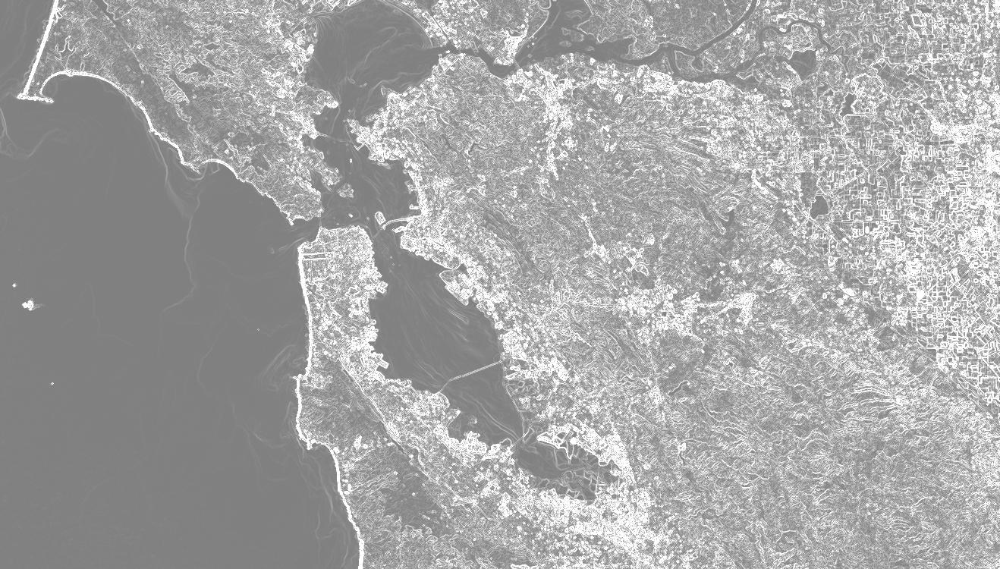{width=670px}

</center>


## Edge detection {-}

[Edge detection](https://en.wikipedia.org/wiki/Edge_detection) is applicable to a wide range of image processing tasks. In addition to the edge detection kernels described in the [convolutions section](), there are several specialized edge detection algorithms in Earth Engine. The Canny edge detection algorithm ([Canny 1986](https://ieeexplore.ieee.org/document/)) uses four separate filters to identify the diagonal, vertical, and horizontal edges. The calculation extracts the first derivative value for the horizontal and vertical directions and computes the gradient magnitude. Gradients of smaller magnitude are suppressed. To eliminate high-frequency noise, optionally pre-filter the image with a Gaussian kernel. For example:

```{r, eval=FALSE}
# Load a Landsat 8 image, select the panchromatic band.
image <- ee.$Image('LANDSAT/LC08/C01/T1/LC08_044034_20140318')$select('B8')

# Perform Canny edge detection and display the result.
canny <- ee$Algorithms$CannyEdgeDetector(list(
  image = image, 
  threshold = 10, 
  sigma = 1)
  )
Map$setCenter(-122.054, 37.7295, 10)
Map$addLayer(canny, {}, 'canny')
```

Note that the `threshold` parameter determines the minimum gradient magnitude and the `sigma` parameter is the standard deviation (SD) of a Gaussian pre-filter to remove high-frequency noise. For line extraction from an edge detector, Earth Engine implements the Hough transform ([Duda and Hart 1972](https://dl.acm.org/doi/10.1145/361237.361242)). Continuing the previous example, extract lines from the Canny detector with:

```{r, eval=FALSE}
# Perform Hough transform of the Canny result and display.
hough <- ee$Algorithms$HoughTransform(canny, 256, 600, 100)
Map$addLayer(hough, {}, 'hough');
```

Another specialized algorithm in Earth Engine is `zeroCrossing()`. A zero-crossing is defined as any pixel where the right, bottom, or diagonal bottom-right pixel has the opposite sign. If any of these pixels is of opposite sign, the current pixel is set to 1 (zero-crossing); otherwise it's set to zero. To detect edges, the zero-crossings algorithm can be applied to an estimate of the image second derivative. The following demonstrates using `zeroCrossing()` for edge detection:

```{r, eval=FALSE}
# Load a Landsat 8 image, select the panchromatic band.
image <- ee$Image('LANDSAT/LC08/C01/T1/LC08_044034_20140318')$select('B8')
Map$addLayer(image, list(max: 12000))

# Define a "fat" Gaussian kernel.
fat <- ee$Kernel$gaussian(list(
  radius = 3,
  sigma = 3,
  units = 'pixels',
  normalize = true,
  magnitude = -1)
)

# Define a "skinny" Gaussian kernel.
skinny <- ee$Kernel$gaussian(list(
  radius = 3,
  sigma = 1,
  units = 'pixels',
  normalize = true)
)

# Compute a difference-of-Gaussians (DOG) kernel.
dog <- fat$add(skinny)

# Compute the zero crossings of the second derivative, display.
zeroXings <- image$convolve(dog)$zeroCrossing()
Map.setCenter(-122.054, 37.7295, 10)
Map.addLayer(zeroXings$selfMask(), list(palette = 'FF0000'), 'zero crossings')
```


The zero-crossings output for an area near the San Francisco, CA airport should look something like Figure 11.

<center>
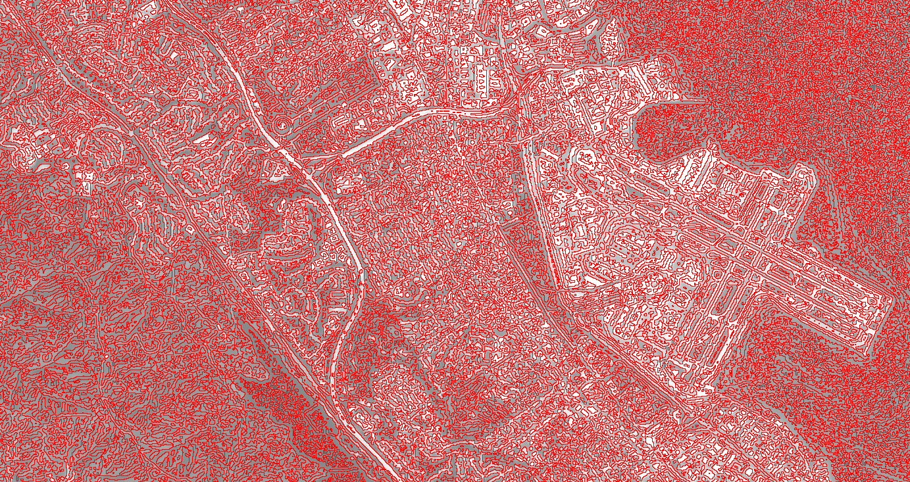{width=670px}

</center>

## Spectral transformations {-}

There are several spectral transformation methods in Earth Engine. These include instance methods on images such as `normalizedDifference()`, `unmix()`, `rgbToHsv()` and `hsvToRgb()`.

### Pan sharpening {-}

Pan sharpening improves the resolution of a multiband image through enhancement provided by a corresponding panchromatic image with finer resolution. The `rgbToHsv()` and `hsvToRgb()` methods are useful for pan sharpening.  

```{r, eval=FALSE}
# Load a Landsat 8 top-of-atmosphere reflectance image.
image <- ee$Image('LANDSAT/LC08/C01/T1_TOA/LC08_044034_20140318')
Map$addLayer(
    image,
    list(bands = c('B4', 'B3', 'B2'), min = 0, max = 0.25, gamma = c(1.1, 1.1, 1)),
    'rgb')

# Convert the RGB bands to the HSV color space.
hsv <- image$select(c('B4', 'B3', 'B2'))$rgbToHsv()

# Swap in the panchromatic band and convert back to RGB.
sharpened <- ee$Image.cat([
  hsv$select('hue'), hsv$select('saturation'), image$select('B8')
])$hsvToRgb()

# Display the pan-sharpened result.
Map$setCenter(-122.44829, 37.76664, 13);
Map$addLayer(sharpened,
             list(min = 0, max = 0.25, gamma = c(1.3, 1.3, 1.3)),
             'pan-sharpened')
```

### Spectral unmixing {-}

Spectral unmixing is implemented in Earth Engine as the `image.unmix()` method. (For more flexible methods, see the [Array Transformations page]()). The following is an example of unmixing Landsat 5 with predetermined urban, vegetation and water endmembers:

```{r, eval=FALSE}
# Load a Landsat 5 image and select the bands we want to unmix.
bands <- ['B1', 'B2', 'B3', 'B4', 'B5', 'B6', 'B7']
image <- ee$Image('LANDSAT/LT05/C01/T1/LT05_044034_20080214')$
  select(bands)
Map$setCenter(-122.1899, 37.5010, 10); ## San Francisco Bay
Map$addLayer(image, list(bands = c('B4', 'B3', 'B2'), min = 0, max = 128), 'image')

# Define spectral endmembers.
urban <- c(88, 42, 48, 38, 86, 115, 59)
veg <- c(50, 21, 20, 35, 50, 110, 23)
water <- c(51, 20, 14, 9, 7, 116, 4)

# Unmix the image.
fractions <- image$unmix(c(urban, veg, water))
Map$addLayer(fractions, {}, 'unmixed');
```


<center>
{width=670px}

</center>


## Texture {-}

Earth Engine has several special methods for estimating spatial texture. When the image is discrete valued (not floating point), you can use `image$entropy()` to compute the [entropy](http://en.wikipedia.org/wiki/Entropy_(information_theory)) in a neighborhood:

```{r, eval=FALSE}
# Load a high-resolution NAIP image.
image <- ee$Image('USDA/NAIP/DOQQ/m_3712213_sw_10_1_20140613')

# Zoom to San Francisco, display.
Map$setCenter(-122.466123, 37.769833, 17)
Map$addLayer(image, {max: 255}, 'image')

# Get the NIR band.
nir <- image.select('N')

# Define a neighborhood with a kernel.
square <- ee$Kernel$square(radius = 4)

# Compute entropy and display.
entropy <- nir.entropy(square)
Map$addLayer(entropy,
             list(min = 1, max = 5, palette = c('0000CC', 'CC0000') ),
             'entropy')
```

Note that the NIR band is scaled to 8-bits prior to calling `entropy()` since the entropy computation takes discrete valued inputs. The non-zero elements in the kernel specify the neighborhood.

Another way to measure texture is with a gray-level co-occurrence matrix (GLCM). Using the image and kernel from the previous example, compute the GLCM-based contrast as follows:

```{r, eval=FALSE}
# Compute the gray-level co-occurrence matrix (GLCM), get contrast.
glcm <- nir$glcmTexture(size = 4)
contrast <- glcm$select('N_contrast')
Map$addLayer(contrast,
             list(min = 0, max = 1500, palette = c('0000CC', 'CC0000')),
             'contrast')
```

Many measures of texture are output by `image$glcm()`. For a complete reference on the outputs, see [Haralick et al. (1973)](https://ieeexplore.ieee.org/document/4309314) and [Conners et al. (1984)](https://www.sciencedirect.com/science/article/abs/pii/0734189X8490197X).

Local measures of spatial association such as Geary’s C (Anselin 1995) can be computed in Earth Engine using `image$neighborhoodToBands()`. Using the image from the previous example:

```{r, eval=FALSE}
# Create a list of weights for a 9x9 kernel.
row <- c(1, 1, 1, 1, 1, 1, 1, 1, 1)
# The center of the kernel is zero.
centerRow = c(1, 1, 1, 1, 0, 1, 1, 1, 1)
# Assemble a list of lists: the 9x9 kernel weights as a 2-D matrix.
rows <- c(row, row, row, row, centerRow, row, row, row, row)
# Create the kernel from the weights.
# Non-zero weights represent the spatial neighborhood.
kernel <- ee$Kernel$fixed(9, 9, rows, -4, -4, false)

# Convert the neighborhood into multiple bands.
neighs <- nir$neighborhoodToBands(kernel)

# Compute local Geary's C, a measure of spatial association.
gearys <- nir$subtract(neighs)$pow(2)$reduce(ee$Reducer$sum())
             $divide(Math$pow(9, 2))
Map$addLayer(gearys,
             list(min = 20, max = 2500, palette = c('0000CC', 'CC0000')),
             "Geary's C")
```

For an example of using neighborhood standard deviation to compute image texture, see the [Statistics of Image Neighborhoods page]().

## Object-based methods {-}

Image objects are sets of connected pixels having the same integer value. Categorical, binned, and boolean image data are suitable for object analysis.

Earth Engine offers methods for labeling each object with a unique ID, counting the number of pixels composing objects, and computing statistics for values of pixels that intersect objects.

- `connectedComponents()`: label each object with a unique identifier.
- `connectedPixelCount()`: compute the number of pixels in each object.
- `reduceConnectedComponents()`: compute a statistic for pixels in each object.

**Caution**: results of object-based methods depend on scale, which is determined by:

- the requested scale of an output (e.g., `Export.image.toAsset()` or `Export.image.toDrive()`).
- functions that require a scale of analysis (e.g., `reduceRegions()` or `reduceToVectors()`).
- Map zoom level.

Take special note of scale determined by Map zoom level. Results of object-based methods will vary when viewing or inspecting image layers in the Map, as each pyramid layer has a different scale. To force a desired scale of analysis in Map exploration, use `reproject()`. However, it is strongly recommended that you **NOT** use `reproject()` because the entire area visible in the Map will be requested at the set scale and projection. At large extents this can cause too much data to be requested, often triggering errors. Within the image pyramid-based architecture of Earth Engine, scale and projection need only be set for operations that provide scale and crs as parameters. See [Scale of Analysis]() and [Reprojecting]() for more information.


### Thermal hotspots {-}

The following sections provide examples of object-based methods applied to Landsat 8 surface temperature with each section building on the former. Run the next snippet to generate the base image: thermal hotspots (> 303 degrees Kelvin) for a small region of San Francisco.

```{r, eval=FALSE}
# Make an area of interest geometry centered on San Francisco.
point <- ee.Geometry.Point(-122.1899, 37.5010);
aoi <- point.buffer(10000);

# Import a Landsat 8 image, subset the thermal band, and clip to the
# area of interest.
kelvin = ee.Image('LANDSAT/LC08/C01/T1_TOA/LC08_044034_20140318')
  .select(['B10'], ['kelvin'])
  .clip(aoi)

# Display the thermal band.
Map$centerObject(point, 13);
Map.$addLayer(kelvin, list(min = 288, max = 305), 'Kelvin')

# Threshold the thermal band to set hot pixels as value 1, mask all else.
hotspots <- kelvin.gt(303)
  .selfMask()
  .rename('hotspots')

# Display the thermal hotspots on the Map.
Map$addLayer(hotspots, list(palette = 'FF0000'), 'Hotspots')
```
<center>
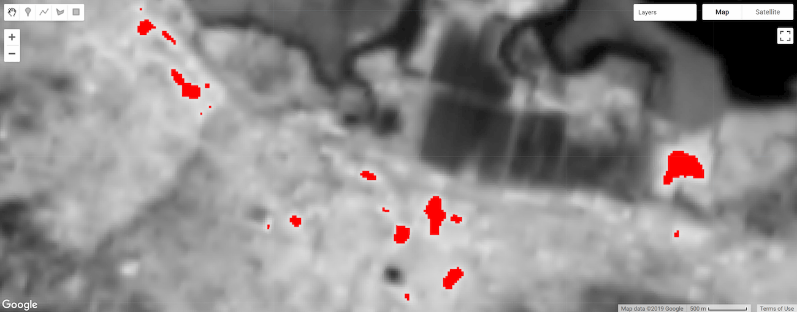{width=670px}

</center>


### Label objects {-}

Labeling objects is often the first step in object analysis. Here, the `connectedComponents()` function is used to identify image objects and assign a unique ID to each; all pixels belonging to an object are assigned the same integer ID value. The result is a copy of the input image with an additional "labels" band associating pixels with an object ID value based on connectivity of pixels in the first band of the image.

```{r, eval=FALSE}
# Uniquely label the hotspot image objects.
objectId <- hotspots$connectedComponents(list(
  connectedness = ee.Kernel.plus(1),
  maxSize = 128)
  )

# Display the uniquely ID'ed objects to the Map.
Map$addLayer(objectId$randomVisualizer(), null, 'Objects')
```

Note that the maximum patch size is set to 128 pixels; objects composed of more pixels are masked. The connectivity is specified by an `ee$Kernel$plus(1)` kernel, which defines four-neighbor connectivity; use `ee$Kernel$square(1)` for eight-neighbor.
<center>
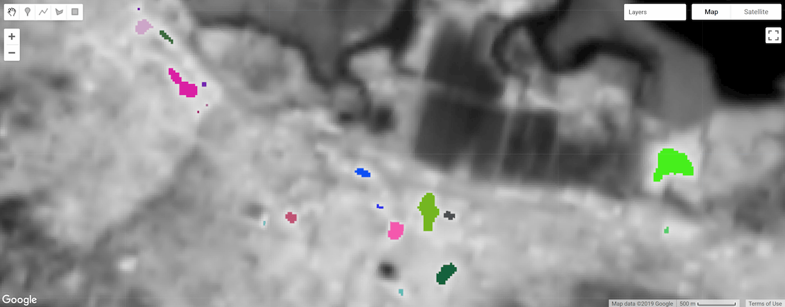{width=670px}

</center>


### Object size {-}

#### Number of pixels {-}
Calculate the number of pixels composing objects using the `connectedPixelCount()` image method. Knowing the number of pixels in an object can be helpful for masking objects by size and calculating object area. The following snippet applies `connectedPixelCount()` to the "labels" band of the `objectId` image defined in the previous section.

```{r, eval=FALSE}
# Compute the number of pixels in each object defined by the "labels" band.
objectSize <- objectId$select('labels')$
  connectedPixelCount(list(
     maxSize = 128, eightConnected = false)
     )

# Display object pixel count to the Map.
Map$addLayer(objectSize, null, 'Object n pixels');
```

`connectedPixelCount()` returns a copy of the input image where each pixel of each band contains the number of connected neighbors according to either the four- or eight-neighbor connectivity rule determined by a boolean argument passed to the `eightConnected` parameter. Note that connectivity is determined independently for each band of the input image. In this example, a single-band image (`objectId`) representing object ID was provided as input, so a single-band image was returned with a "labels" band (present as such in the input image), but now the values represent the number of pixels composing objects; every pixel of each object will have the same pixel count value.
<center>
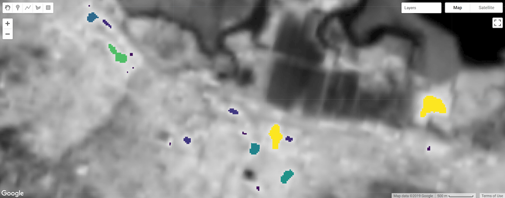{width=670px}

</center>


#### Area {-}
Calculate object area by multiplying the area of a single pixel by the number of pixels composing an object (determined by `connectedPixelCount()`). Pixel area is provided by an image generated from `ee$Image$pixelArea()`.

```{r, eval=FALSE}
# Get a pixel area image.
pixelArea <- ee$Image$pixelArea()

# Multiply pixel area by the number of pixels in an object to calculate
# the object area. The result is an image where each pixel
# of an object relates the area of the object in m^2.
objectArea <- objectSize$multiply(pixelArea)

# Display object area to the Map.
Map$addLayer(objectArea,
             list(min = 0, max = 30000, palette = c('0000FF', 'FF00FF')),
             'Object area m^2')
```

The result is an image where each pixel of an object relates the area of the object in square meters. In this example, the `objectSize` image contains a single band, if it were multi-band, the multiplication operation would be applied to each band of the image.

### Filter objects by size {-}
Object size can be used as a mask condition to focus your analysis on objects of a certain size (e.g., mask out objects that are too small). Here the `objectArea` image calculated in the previous step is used as a mask to remove objects whose area are less than one hectare.

```{r, eval=FALSE}
# Threshold the `objectArea` image to define a mask that will mask out
# objects below a given size (1 hectare in this case).
areaMask <- objectArea$gte(10000)

# Update the mask of the `objectId` layer defined previously using the
# minimum area mask just defined.
objectId <- objectId$updateMask(areaMask)
Map$addLayer(objectId, null, 'Large hotspots')
```

The result is a copy of the `objectId` image where objects less than one hectare are masked out.

Figure 16a. Thermal hotspot objects labeled and styled by unique ID.             |  Figure 16b. Thermal hotspot objects filtered by minimum area (1 hectare).
:-------------------------:|:-------------------------:
{width=300px}  |  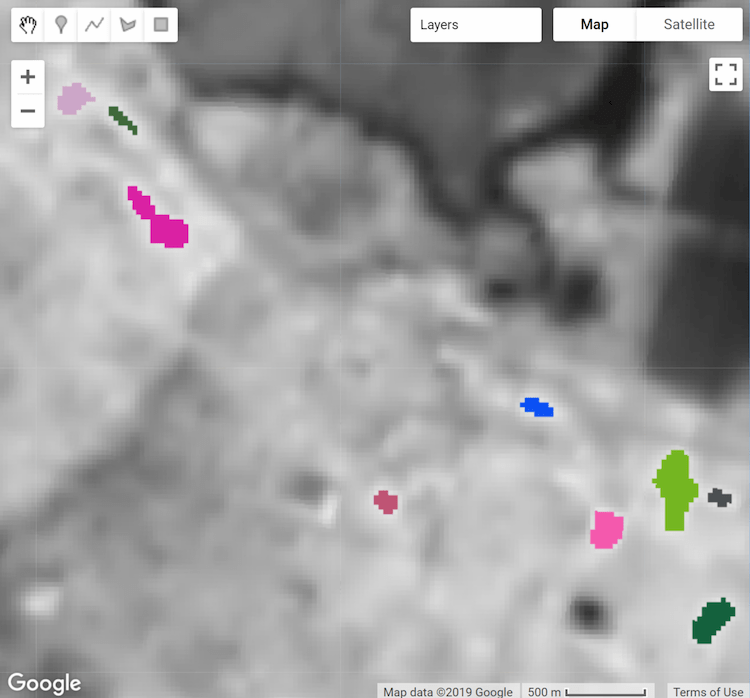{width=300px}

### Zonal statistics {-}

The `reduceConnectedComponents()` method applies a reducer to the pixels composing unique objects. The following snippet uses it to calculate the mean temperature of hotspot objects. `reduceConnectedComponents()` requires an input image with a band (or bands) to be reduced and a band that defines object labels. Here, the `objectID` "labels" image band is added to the `kelvin` temperature image to construct a suitable input image.

```{r, eval=FALSE}
# Make a suitable image for `reduceConnectedComponents()` by adding a label
# band to the `kelvin` temperature image.
kelvin <- kelvin$addBands(objectId$select('labels'))

# Calculate the mean temperature per object defined by the previously added
# "labels" band.
patchTemp <- kelvin$reduceConnectedComponents(list(
  reducer = ee$Reducer$mean(),
  labelBand = 'labels')
)

# Display object mean temperature to the Map.
Map$addLayer(
  patchTemp,list(
    min = 303, max = 304, palette = c('yellow', 'red')),
  'Mean temperature'
)
```

The result is a copy of the input image without the band used to define objects, where pixel values represent the result of the reduction per object, per band.
<center>
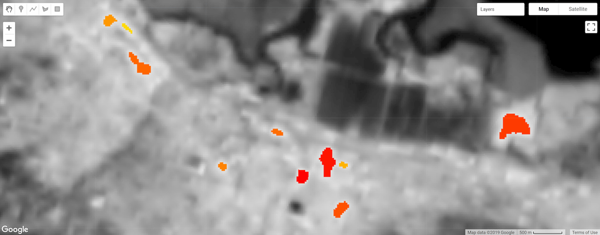{width=670px}

</center>


- **Note**: `reduceToVectors()` provides similar functionality, except that the result is an `ee$FeatureCollection`, where each feature of the collection represents an object and the reduction of the pixels in each objects is expressed as a feature property for each band in the input image. `reduceToVectors()` is resource intensive, so use `reduceConnectedComponents()` whenever possible. See Raster to Vector Conversion for more information.


## Cumulative Cost Mapping {-}

Use `image$cumulativeCost()` to compute a cost map where every pixel contains the total cost of the lowest cost path to the nearest source location. This process is useful in a variety of contexts such as habitat analysis ([Adriaensen et al. 2003](http://www.sciencedirect.com/science/article/pii/S0169204602002426)), watershed delineation ([Melles et al. 2011](https://www.sciencedirect.com/science/article/pii/S1878029611001691)) and image segmentation ([Falcao et al. 2004](http://ieeexplore.ieee.org/stamp/stamp.jsp?arnumber=1261076)). Call the cumulative cost function on an image in which each pixel represents the cost per meter to traverse it. Paths are computed through any of a pixel's eight neighbors. Required inputs include a `source` image, in which each non-zero pixel represents a potential source (or start of a path), and a `maxDistance` (in meters) over which to compute paths. The algorithm finds the cumulative cost of all paths less than *maxPixels* = `maxDistance`/*scale* in length, where scale is the pixel resolution, or [scale of analysis in Earth Engine]().

The following example demonstrates computing least-cost paths across a land cover image:
```{r, eval=FALSE}
# A rectangle representing Bangui, Central African Republic.
geometry <- ee$Geometry$Rectangle(c(18.5229, 4.3491, 18.5833, 4.4066))

# Create a source image where the geometry is 1, everything else is 0.
sources <- ee$Image()$toByte()$paint(geometry, 1)

# Mask the sources image with itself.
sources <- sources$selfMask()

# The cost data is generated from classes in ESA/GLOBCOVER.
cover <- ee$Image('ESA/GLOBCOVER_L4_200901_200912_V2_3')$select(0)

# Classes 60, 80, 110, 140 have cost 1.
# Classes 40, 90, 120, 130, 170 have cost 2.
# Classes 50, 70, 150, 160 have cost 3.
beforeRemap <- c(60, 80, 110, 140,
                40, 90, 120, 130, 170,
                50, 70, 150, 160)
afterRemap <- c(1, 1, 1, 1,
                2, 2, 2, 2, 2,
                3, 3, 3, 3)
cost <- cover$remap(beforeRemap, afterRemap, 0)

# Compute the cumulative cost to traverse the land cover.
cumulativeCost <- cost$cumulativeCost(list(
  source = sources,
  maxDistance = 80 * 1000)  ## 80 kilometers
  )

# Display the results
Map$setCenter(18.71, 4.2, 9)
Map$addLayer(cover, {}, 'Globcover')
Map$addLayer(cumulativeCost, list(min = 0, max = 5e4), 'accumulated cost')
Map$addLayer(geometry, list(color = 'FF0000'), 'source geometry')
```

The result should look something like Figure 18, in which each output pixel represents the accumulated cost to the nearest source. Note that discontinuities can appear in places where the least cost path to the nearest source exceeds *maxPixels* in length.
<center>
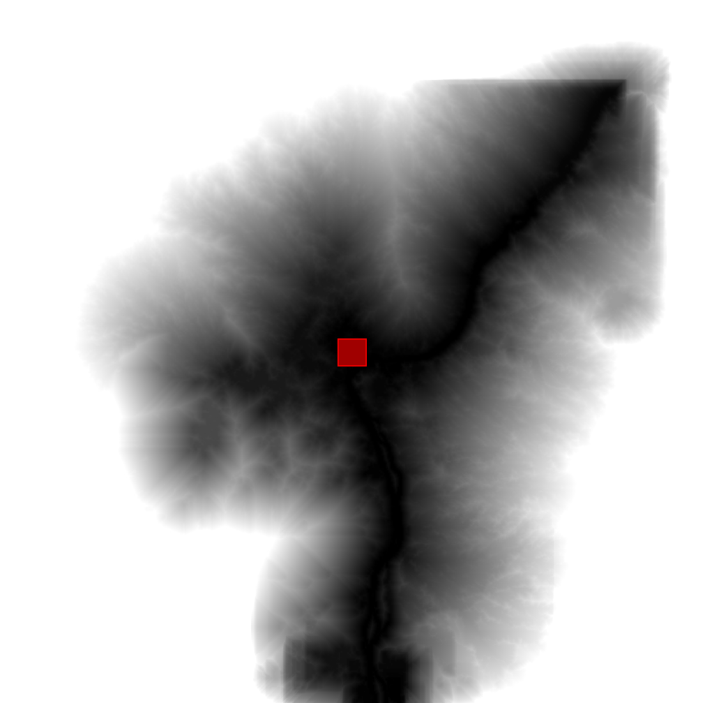{width=660px}

</center>

## Registering Images {-}

The Earth Engine image registration algorithm is designed to be a final, post-ortho, fine-grained step in aligning images. It is assumed that the images to be registered have already gone through initial alignment stages, so they are already within a few degrees of rotation of one another, and differ by only small translations. The registration uses a “rubber-sheet” technique, allowing local image warping to correct for orthorectification errors and other artifacts from earlier processing. The underlying alignment technique is image correlation, so the bands for the input and reference images must be visually similar in order for the algorithm to compute an accurate alignment.

### Image displacement {-}

There are two steps to registering an image: Determining the displacement image using `displacement()`, and then applying it with `displace()`. The required inputs are the pair of images to register, and a maximum displacement parameter (`maxOffset`).

The `displacement()` algorithm takes a reference image, a maximum displacement parameter (`maxOffset`), and two optional parameters that modify the algorithm behaviour. The output is a displacement image with bands dx and dy which give the X and Y components (in meters) of the displacement vector at each pixel.

All bands of the calling and reference images are used for matching during registration, so the number of bands must be exactly equal. The input bands must be visually similar for registration to succeed. If that is not the case, it may be possible to pre-process them (e.g. smoothing, edge detection) to make them appear more similar. The registration computations are performed using a multiscale, coarse-to-fine process, with (multiscale) working projections that depend on three of the projections supplied to the algorithm:

1. the default projection of the calling image (Pc)
2. the default projection of the reference image (Pr)
3. the output projection (Po)

The highest resolution working projection (Pw will be in the CRS of Pr, at a scale determined by the coarsest resolution of these 3 projections, to minimize computation. The results from Pr are then resampled to be in the projection specified by the input ‘projection’ parameter.

The output is a displacement image with the following bands:

`dx`
- For a given reference image pixel location, this band contains the distance in the X direction that must be travelled to arrive at the matching location in the calling image. Units are in geodesic meters.

`dy`
- For a given reference image pixel location, this band contains the distance in the Y direction that must be travelled to arrive at the matching location in the calling image. Units are in geodesic meters.

`confidence`
- This is a per-pixel estimate of displacement confidence (where 0 is low confidence and 1 is high confidence) based on the correlation scores in regions where valid matches were found. In regions where no matches were found, confidence is estimated from nearby correlations using a Gaussian kernel to provide higher weight to nearby correlations.

The following example computes the magnitude and angle of displacement between two high-resolution [Terra Bella]() images:

```{r, eval=FALSE}
# Load the two images to be registered.
image1 <- ee$Image('SKYSAT/GEN-A/PUBLIC/ORTHO/MULTISPECTRAL/s01_20150502T082736Z')
image2 <- ee$Image('SKYSAT/GEN-A/PUBLIC/ORTHO/MULTISPECTRAL/s01_20150305T081019Z')

# Use bicubic resampling during registration.
image1Orig <- image1$resample('bicubic')
image2Orig <- image2$resample('bicubic')

# Choose to register using only the 'R' band.
image1RedBand <- image1Orig$select('R')
image2RedBand <- image2Orig$select('R')

# Determine the displacement by matching only the 'R' bands.
displacement <- image2RedBand.displacement(list(
  referenceImage = image1RedBand,
  maxOffset = 50.0,
  patchWidth = 100.0)
)

# Compute image offset and direction.
offset <- displacement$select('dx')$hypot(displacement$select('dy'))
angle <- displacement$select('dx')$atan2(displacement$select('dy'))

# Display offset distance and angle.
Map$addLayer(offset, list(min = 0, max = 20), 'offset')
Map$addLayer(angle, list(min = -Math.PI, max = Math.PI), 'angle')
Map$setCenter(37.44,0.58, 15)
```

### Warping an image {-}

There are two ways to warp an image to match another image: `displace()` or `register()`. The `displace()` algorithm takes a displacement image having `dx` and `dy` bands as the first two bands, and warps the image accordingly. The output image will be the result of warping the bands of the input image by the offsets present in the displacement image. Using the displacements computed in the previous example:

```{r, eval=FALSE}
# Use the computed displacement to register all original bands.
registered <- image2Orig$displace(displacement)

# Show the results of co-registering the images.
visParams <- list(bands = c('R', 'G', 'B'), max = 4000)
Map$addLayer(image1Orig, visParams, 'Reference')
Map$addLayer(image2Orig, visParams, 'Before Registration')
Map$addLayer(registered, visParams, 'After Registration')
```

If you don't need the displacement bands, Earth Engine provides the `register()` method, which is a shortcut for calling `displacement()` followed by `displace()`. For example:

```{r, eval=FALSE}
alsoRegistered <- image2Orig$register(list(
  referenceImage = image1Orig,
  maxOffset = 50.0,
  patchWidth = 100.0)
  )
Map.addLayer(alsoRegistered, visParams, 'Also Registered')
```

In this example, the results of `register()` differ from the results of `displace()`. This is because a different set of bands was used in the two approaches: `register()` always uses all bands of the input images, while the `displacement()` example used only the red band before feeding the result to `displace()`. Note that when multiple bands are used, if band variances are very different this could over-weight the high-variance bands, since the bands are jointly normalized when their spatial correlation scores are combined. This illustrates the importance of selecting band(s) that are visually the most similar when registering. As in the previous example, use `displacement()` and `displace()` for control over which bands are used to compute displacement.


# ImageCollection

To start your journey in mastering R, the following six chapters will help you learn the foundational components of R. I expect that you've already seen many of these pieces before, but you probably have not studied them deeply. To help check your existing knowledge, each chapter starts with a quiz; if you get all the questions right, feel free to skip to the next chapter!

## ImageCollection Overview {-}
>>>>>>> master

An **`ImageCollection`** is a stack or sequence of images. An **`ImageCollection`** can be loaded by pasting an Earth Engine asset ID into the **`ImageCollection`** constructor. You can find **`ImageCollection`** IDs in the [data catalog](https://developers.google.com/earth-engine/datasets). For example, to load the [Sentinel-2 surface reflectance collection](https://developers.google.com/earth-engine/guides/datasets/catalog/COPERNICUS_S2_SR):

<<<<<<< HEAD

## Gradients {-}
=======
```{r, eval=FALSE}
sentinelCollection <- ee$ImageCollection('COPERNICUS/S2_SR')
```
>>>>>>> master

This collection contains every Sentinel-2 image in the public catalog. There are a lot. Usually you want to filter the collection as shown [here](https://developers.google.com/earth-engine/guides/ic_info) or [here](https://developers.google.com/earth-engine/guides/ic_filtering).

In addition to loading an **`ImageCollection`** using an Earth Engine collection ID, Earth Engine has methods to create image collections. The constructor **`ee.ImageCollection()`** or the convenience method **`ee.ImageCollection.fromImages()`** create image collections from lists of images. You can also create new image collections by merging existing collections. For example:

```{r, eval=FALSE}
<<<<<<< HEAD
# Load a Landsat 8 image and select the panchromatic band.
image <- ee$Image('LANDSAT/LC08/C01/T1/LC08_044034_20140318')$select('B8')

# Compute the image gradient in the X and Y directions.
xyGrad <- image$gradient()

# Compute the magnitude of the gradient.
gradient <- xyGrad$select('x')$pow(2)$
  add(xyGrad$select('y')$pow(2))$sqrt()

# Compute the direction of the gradient.
direction <- xyGrad$select('y')$atan2(xyGrad$select('x'))

# Display the results.
Map$setCenter(-122.054, 37.7295, 10);
Map$addLayer(direction, list(min: -2, max: 2, format: 'png'), 'direction')
Map$addLayer(gradient, list(min: -7, max: 7, format: 'png'), 'gradient')
=======
# Create arbitrary constant images.
constant1 <- ee$Image(1)
constant2 <- ee$Image(2)

# Create a collection by giving a list to the constructor.
collectionFromConstructor <- ee$ImageCollection(c(constant1, constant2))
print(paste0("collectionFromConstructor: ", ee$ImageCollection$getInfo(collectionFromConstructor)))

# Create a collection with fromImages().
collectionFromImages <- ee$ImageCollection$fromImages(
  c(ee$Image(3), ee$Image(4)))
print(paste0('collectionFromImages: ', ee$collectionFromImages$getInfo(collectionFromImages)))

# Merge two collections.
mergedCollection = collectionFromConstructor$merge(collectionFromImages)
print(paste0('mergedCollection: ', ee$mergedCollection$getInfo(mergedCollection)))

# Create a toy FeatureCollection.
features <- ee$FeatureCollection(
  c(ee$Feature(NULL, {foo = 1}), ee$Feature(NULL, {foo = 2})))

# Create an ImageCollection from the FeatureCollection
# by mapping a function over the FeatureCollection.
images <- features$map(
  function(feature){
    return(
      ee$Image(ee$Number(feature$get('foo')))
    )
  }
)

# Print the resultant collection.
print(paste0('Image collection: ', ee$images$getInfo(Image collection)))
```

Note that in this example an **`ImageCollection`** is created by mapping a function that returns an **`Image`** over a **`FeatureCollection`**. Learn more about mapping in the [Mapping over an ImageCollection section](https://developers.google.com/earth-engine/guides/ic_mapping). Learn more about feature collections from the [FeatureCollection section](https://developers.google.com/earth-engine/guides/feature_collections).

You can also create an **`ImageCollection`** from GeoTiffs in Cloud Storage. For example:

```{r, eval=FALSE}
# All the GeoTiffs are in this folder.
uriBase <- 'gs://gcp-public-data-landsat/LC08/01/001/002/' + 
  'LC08_L1GT_001002_20160817_20170322_01_T2/'

# List of URIs, one for each band.
uris <- ee$List(c(
  uriBase + 'LC08_L1GT_001002_20160817_20170322_01_T2_B2.TIF',
  uriBase + 'LC08_L1GT_001002_20160817_20170322_01_T2_B3.TIF',
  uriBase + 'LC08_L1GT_001002_20160817_20170322_01_T2_B4.TIF',
  uriBase + 'LC08_L1GT_001002_20160817_20170322_01_T2_B5.TIF',
))

# Make a collection from the list of images.
images <- uris$map(ee$Image$loadGeoTIFF)
collection <- ee$ImageCollection(images)

# Get an RGB image from the collection of bands.
rgb <- collection$toBands()$rename(c('B2', 'B3', 'B4', 'B5'))
Map$centerObject(rgb)
Map$addLayer(rgb, {bands <- c('B4', 'B3', 'B2'), min: 0, max: 20000}, 'rgb')
>>>>>>> master
```

[Learn more about loading images from Cloud GeoTiffs]()

## ImageCollection Visualization {-}

Images composing an **`ImageCollection`** can be visualized as either an animation or a series of thumbnails referred to as a “filmstrip”. These methods provide a quick assessment of the contents of an **`ImageCollection`** and an effective medium for witnessing spatiotemporal change (Figure 1).

* [getVideoThumbURL()]()  produces an animated image series
* [getFilmstripThumbURL()]() produces a thumbnail image series

The following sections describe how to prepare an **`ImageCollection`** for visualization, provide example code for each collection visualization method, and cover several advanced animation techniques.

<center>
<<<<<<< HEAD
{width=670px}

</center>
=======

</center>
Figure 1. Animation showing a three-day progression of Atlantic hurricanes in September, 2017.

### Collection preparation {-}
>>>>>>> master

Filter, composite, sort, and style images within a collection to display only those of interest or emphasize a phenomenon. Any **`ImageCollection`** can be provided as input to the visualization functions, but a curated collection with consideration of inter- and intra-annual date ranges, observation interval, regional extent, quality and representation can achieve better results.


#### Filtering {-}

Filter an image collection to include only relevant data that supports the purpose of the visualization. Consider dates, spatial extent, quality, and other properties specific to a given dataset.

For instance, filter a Sentinel-2 surface reflectance collection by:

a single date range,

```{r, eval=FALSE}
<<<<<<< HEAD
# Load a Landsat 8 image, select the panchromatic band.
image <- ee.$Image('LANDSAT/LC08/C01/T1/LC08_044034_20140318')$select('B8')

# Perform Canny edge detection and display the result.
canny <- ee$Algorithms$CannyEdgeDetector(list(
  image = image, 
  threshold = 10, 
  sigma = 1)
  )
Map$setCenter(-122.054, 37.7295, 10)
Map$addLayer(canny, {}, 'canny')
=======
s2col <- ee$ImageCollection('COPERNICUS/S2_SR')$
  filterDate('2018-01-01', '2019-01-01')
>>>>>>> master
```

a serial day-of-year range,

```{r, eval=FALSE}
<<<<<<< HEAD
# Perform Hough transform of the Canny result and display.
hough <- ee$Algorithms$HoughTransform(canny, 256, 600, 100)
Map$addLayer(hough, {}, 'hough');
=======
s2col <- ee$ImageCollection('COPERNICUS/S2_SR')$
  filter(ee$Filter$calendarRange(171, 242, 'day_of_year'))
>>>>>>> master
```

a region of interest,

```{r, eval=FALSE}
<<<<<<< HEAD
# Load a Landsat 8 image, select the panchromatic band.
image <- ee$Image('LANDSAT/LC08/C01/T1/LC08_044034_20140318')$select('B8')
Map$addLayer(image, list(max: 12000))

# Define a "fat" Gaussian kernel.
fat <- ee$Kernel$gaussian(list(
  radius = 3,
  sigma = 3,
  units = 'pixels',
  normalize = true,
  magnitude = -1)
)

# Define a "skinny" Gaussian kernel.
skinny <- ee$Kernel$gaussian(list(
  radius = 3,
  sigma = 1,
  units = 'pixels',
  normalize = true)
)

# Compute a difference-of-Gaussians (DOG) kernel.
dog <- fat$add(skinny)

# Compute the zero crossings of the second derivative, display.
zeroXings <- image$convolve(dog)$zeroCrossing()
Map.setCenter(-122.054, 37.7295, 10)
Map.addLayer(zeroXings$selfMask(), list(palette = 'FF0000'), 'zero crossings')
=======
s2col <- ee$ImageCollection('COPERNICUS/S2_SR')$
  filterBounds(ee$Geometry$Point(-122.1, 37.2))
```

or an image property.

```{r, eval=FALSE}
s2col <- ee$ImageCollection('COPERNICUS/S2_SR')$
  filter(ee$Filter$lt('CLOUDY_PIXEL_PERCENTAGE', 50))
```

Chain multiple filters.

```{r, eval=FALSE}
s2col <- ee$ImageCollection('COPERNICUS/S2_SR')$
  filterDate('2018-01-01', '2019-01-01')$
  filterBounds(ee$Geometry$Point(-122.1, 37.2))$
  filter('CLOUDY_PIXEL_PERCENTAGE < 50')
>>>>>>> master
```

#### Compositing {-}

Composite intra- and inter-annual date ranges to reduce the number of images in a collection and improve quality. For example, suppose you were to create a visualization of annual NDVI for Africa. One option is to simply filter a MODIS 16-day NDVI collection to include all 2018 observations.

<<<<<<< HEAD
<center>
{width=670px}

</center>

=======
```{r, eval=FALSE}
ndviCol <- ee$ImageCollection('MODIS/006/MOD13A2')$
  filterDate('2018-01-01', '2019-01-01')$
  select('NDVI')
```

##### **Inter-annual composite by filter and reduce** {-}
>>>>>>> master

Visualization of the above collection shows considerable noise in the forested regions where cloud cover is heavy (Figure 2a). A better representation can be achieved by reducing serial date ranges by median across all years in the MODIS collection.

```{r, eval=FALSE}
# Make a day-of-year sequence from 1 to 365 with a 16-day step.
doyList <- ee$List$sequence(1, 365, 16)

# Import a MODIS NDVI collection.
ndviCol <- ee$ImageCollection('MODIS/006/MOD13A2')$select('NDVI')

# Map over the list of days to build a list of image composites.
ndviCompList <- doyList$map(
  function(startDoy) {
    #Ensure that startDoy is a number.
    startDoy = ee$Number(startDoy)
    
    # Filter images by date range; starting with the current startDate and
    # ending 15 days later. Reduce the resulting image collection by median.
    return(
      ndviCol$
        filter(ee$Filter$calendarRange(startDoy, startDoy.add(15), 'day_of_year'))$
        reduce(ee$Reducer$median())
    )
  }
)

# Convert the image List to an ImageCollection.
ndviCol = ee$ImageCollection$fromImages(ndviCompList)
```

The animation resulting from this collection is less noisy, as each image represents the median of a 16-day NDVI composite for 20+ years of data (Figure 1b). See [this tutorial]() for more information on this animation.

<div class="devsite-table-wrapper">
  <table>
    <thead>
      <tr>
        <th style="text-align: left">
          
        </th>
          <th style="text-align: left">
        
        </th>
      </tr>
    </thead>
    <tbody>
      <tr>
        <td style="text-align: left">
          Figure 2a. Annual NDVI
          <em>without</em>
          inter-annual compositing.
        </td>
        <td style="text-align: left">
          Figure 2b. Annual NDVI
          <em>with</em>
          inter-annual compositing.
        </td>
      </tr>
    </tbody>
  </table>
</div>

##### **Intra-annual composite by filter and reduce** {-}

The previous example applies inter-annual compositing. It can also be helpful to composite a series of intra-annual observations. For example, Landsat data are collected every sixteen days for a given scene per sensor, but often some portion of the images are obscured by clouds. Masking out the clouds and compositing several images from the same season can produce a more cloud-free representation. Consider the following example where Landsat 5 images from July and August are composited using median for each year from 1985 to 2011.

```{r, eval=FALSE}
<<<<<<< HEAD
# Load a Landsat 8 top-of-atmosphere reflectance image.
image <- ee$Image('LANDSAT/LC08/C01/T1_TOA/LC08_044034_20140318')
Map$addLayer(
    image,
    list(bands = c('B4', 'B3', 'B2'), min = 0, max = 0.25, gamma = c(1.1, 1.1, 1)),
    'rgb')

# Convert the RGB bands to the HSV color space.
hsv <- image$select(c('B4', 'B3', 'B2'))$rgbToHsv()

# Swap in the panchromatic band and convert back to RGB.
sharpened <- ee$Image.cat([
  hsv$select('hue'), hsv$select('saturation'), image$select('B8')
])$hsvToRgb()

# Display the pan-sharpened result.
Map$setCenter(-122.44829, 37.76664, 13);
Map$addLayer(sharpened,
             list(min = 0, max = 0.25, gamma = c(1.3, 1.3, 1.3)),
             'pan-sharpened')
=======
# Assemble a collection of Landsat surface reflectance images for a given
# region and day-of-year range.
lsCol <- ee$ImageCollection('LANDSAT/LT05/C02/T1_L2')$
  filterBounds(ee$Geometry$Point(-122.9, 43.6))$
  filter(ee$Filter$dayOfYear(182, 243))$
  # Add the observation year as a property to each image.
  map(
    function(img) {
      return(
        img$set('year', ee$Image(img)$date()$get('year'))
      )
    }
  )
  
# Define a function to scale the data and mask unwanted pixels.
function maskL457sr(image) {
  # Bit 0 - Fill
  # Bit 1 - Dilated Cloud
  # Bit 2 - Unused
  # Bit 3 - Cloud
  # Bit 4 - Cloud Shadow
  qaMask <- image$select('QA_PIXEL')$bitwiseAnd(parseInt('11111', 2))$eq(0)
  saturationMask <- image$select('QA_RADSAT')$eq(0)
  
  # Apply the scaling factors to the appropriate bands.
  opticalBands <- image$select('SR_B.')$multiply(0.0000275)$add(-0.2)
  thermalBand <- image$select('ST_B6')$multiply(0.00341802)$add(149.0)
  
  # Replace the original bands with the scaled ones and apply the masks.
  return(
    image$addBands(opticalBands, null, true)$
      addBands(thermalBand, null, true)$
      updateMask(qaMask)$
      updateMask(saturationMask)
  )
}

# Define a list of unique observation years from the image collection.
years <- ee$List(lsCol$aggregate_array('year'))$distinct()$sort()

# Map over the list of years to build a list of annual image composites.
lsCompList <- years$map(
  function(year) {
    return(
      lsCol$
        # Filter image collection by year.
        filterMetadata('year', 'equals', year)$
        # Apply cloud mask.
        map(maskL457sr)$
        # Reduce image collection by median.
        reduce(ee$Reducer$median())$
        # Set composite year as an image property.
        set('year', year)
    )
  }
)

# Convert the image List to an ImageCollection.
lsCompCol <- ee$ImageCollection$fromImages(lsCompList)
```

##### **Intra-annual composite by join and reduce** {-}

Note that the previous two compositing methods map over a List of days and years to incrementally define new dates to filter and composite over. Applying a join is another method for achieving this operation. In the following snippet, a unique year collection is defined and then a saveAll join is applied to identify all images that correspond to a given year. Images belonging to a given year are grouped into a List object which is stored as a property of the respective year representative in the distinct year collection. Annual composites are generated from these lists by reducing ImageCollections defined by them in a function mapped over the distinct year collection.

```{r, eval=FALSE}
# Assemble a collection of Landsat surface reflectance images for a given
# region and day-of-year range.
lsCol <- ee$ImageCollection('LANDSAT/LT05/C02/T1_L2')$
  filterBounds(ee$Geometry$Point(-122.9, 43.6))$
  filter(ee$Filter$dayOfYear(182, 243))$
  # Add the observation year as a property to each image.
  map(function(img) {
    return(
      img$set('year', ee$Image(img)$date()$get('year'))
    )
  }
  
# Make a distinct year collection; one image representative per year.
distinctYears <- lsCol$distinct('year')$sort('year')

# Define a join filter; one-to-many join on ‘year’ property.
filter <- ee$Filter$equals({leftField = 'year', rightField = 'year'})

# Define a join.
join <- ee$Join$saveAll('year_match')

# Apply the join; results in 'year_match' property being added to each distinct
# year representative image. The list includes all images in the collection
# belonging to the respective year.
joinCol <- join$apply(distinctYears, lsCol, filter)

# Define a function to scale the data and mask unwanted pixels.
function maskL457sr(image) {
  # Bit 0 - Fill
  # Bit 1 - Dilated Cloud
  # Bit 2 - Unused
  # Bit 3 - Cloud
  # Bit 4 - Cloud Shadow
  qaMask <- image$select('QA_PIXEL')$bitwiseAnd(parseInt('11111', 2))$eq(0)
  saturationMask <- image$select('QA_RADSAT')$eq(0)
  
  # Apply the scaling factors to the appropriate bands.
  opticalBands <- image$select('SR_B.')$multiply(0.0000275)$add(-0.2)
  thermalBand <- image$select('ST_B6')$multiply(0.00341802)$add(149.0)

  # Replace the original bands with the scaled ones and apply the masks.
  return(
    image$addBands(opticalBands, null, true)$
    addBands(thermalBand, null, true)$
    updateMask(qaMask)$
    updateMask(saturationMask)
  )
}

# Map over the distinct years collection to build a list of annual image
# composites.
lsCompList <- joinCol$map(
  function(img) {
    # Get the list of images belonging to the given year.
    return(
     ee$ImageCollection$fromImages(img$get('year_match'))$
       # Apply cloud mask.
       map(maskL457sr)$
       # Reduce image collection by median.
       reduce(ee$Reducer$median())$
       # Set composite year as an image property.
       copyProperties(img, c('year'))
    )
  }
)

# Convert the image List to an ImageCollection.
lsCompCol <- ee$ImageCollection(lsCompList)
>>>>>>> master
```

##### **Same-day composite by join and reduce** {-}

An additional case for compositing is to create spatially contiguous image mosaics. Suppose your region of interest spans two Landsat rows within the same path and your objective is to display an image mosaic of the two images for each Landsat 8 orbit in 2017 and 2018. Here, after filtering the collection by path and row, a join operation is used to mosaic Landsat images from the same obit, defined by acquisition date.

```{r, eval=FALSE}
<<<<<<< HEAD
# Load a Landsat 5 image and select the bands we want to unmix.
bands <- ['B1', 'B2', 'B3', 'B4', 'B5', 'B6', 'B7']
image <- ee$Image('LANDSAT/LT05/C01/T1/LT05_044034_20080214')$
  select(bands)
Map$setCenter(-122.1899, 37.5010, 10); ## San Francisco Bay
Map$addLayer(image, list(bands = c('B4', 'B3', 'B2'), min = 0, max = 128), 'image')

# Define spectral endmembers.
urban <- c(88, 42, 48, 38, 86, 115, 59)
veg <- c(50, 21, 20, 35, 50, 110, 23)
water <- c(51, 20, 14, 9, 7, 116, 4)

# Unmix the image.
fractions <- image$unmix(c(urban, veg, water))
Map$addLayer(fractions, {}, 'unmixed');
```


<center>
{width=670px}

</center>

=======
lsCol <- ee$ImageCollection('LANDSAT/LC08/C02/T1_L2')$
  filterDate('2017-01-01', '2019-01-01')$
  filter('WRS_PATH == 38 && (WRS_ROW == 28 || WRS_ROW == 29)')$
  map(function(img) {
    date = img$date()$format('YYYY-MM-dd')
    return(
      img$set('date', date)
    )
  }
  
distinctDates <- lsCol$distinct('date')$sort('date')
ilter <- ee$Filter$equals({leftField <- 'date', rightField <- 'date'})
join <- ee$Join$saveAll('date_match')
joinCol <- join$apply(distinctDates, lsCol, filter)

lsColMos <- ee$ImageCollection(
  joinCol$map(
    function(col) {
      return(
        ee$ImageCollection$fromImages(col$get('date_match'))$mosaic()
      )
    }
  )
)
```

#### Sorting {-}

Sort a collection by time to ensure proper chronological sequence, or order by a property of your choice. By default, the visualization frame series is sorted in natural order of the collection. The arrangement of the series can be altered using the sort collection method, whereby an Image property is selected for sorting in either ascending or descending order. For example, to sort by time of observation, use the ubiquitous **`system:time_start property`**.

```{r, eval=FALSE}
s2col <- ee$ImageCollection('COPERNICUS/S2_SR')$
  filterBounds(ee$Geometry$Point(-122.1, 37.2))$
  sort('system:time_start')
```

Or perhaps the order should be defined by increasing cloudiness, as in this case of Sentinel-2 imagery.
>>>>>>> master

```{r, eval=FALSE}
s2col <- ee$ImageCollection('COPERNICUS/S2_SR')$
  filterBounds(ee$Geometry$Point(-122.1, 37.2))$
  sort('CLOUDY_PIXEL_PERCENTAGE')
```

Order can also be defined by a derived property, such as mean regional NDVI. Here, regional NDVI is added as a property to each image in a mapped function, followed by a sort on the new property.

<<<<<<< HEAD
## Texture {-}
=======
```{r, eval=FALSE}
# Define an area of interest geometry.
aoi <- ee$Geometry$Point(-122.1, 37.2)$buffer(1e4)

# Filter MODIS NDVI image collection by a date range.
ndviCol <- ee$ImageCollection('MODIS/006/MOD13A1')$
  filterDate('2018-01-01', '2019-01-01')$
  select('NDVI')$
  # Map over the image collection to calculate regional mean NDVI and add
  # the result to each image as a property.
  map(
    function(img) {
      meanNdvi = img.reduceRegion(
        {
          reducer = ee$Reducer$mean(), geometry <- aoi, scale <- 500
        }
      )
      return(
        img$set('meanNdvi', meanNdvi$get('NDVI'))
      )
    }
  )$
  # Sort the collection by descending regional mean NDVI.
  sort('meanNdvi', FALSE)
```
>>>>>>> master

#### Image visualization {-}

Image visualization transforms numbers into colors. There are three ways to control how image data are represented as color in collection visualization methods:

1. Provide visualization arguments directly to **`getVideoThumbURL`** and **`getFilmstripThumbUR`**.

2. Map the visualize image method over the image collection prior to application of **`getVideoThumbURL`** and **`getFilmstripThumbUR`**.

3. Map the sldStyle image method over the image collection prior to application of **`getVideoThumbURL`** and **`getFilmstripThumbUR`**. See [Styled Layer Descriptor](https://developers.google.com/earth-engine/guides/image_visualization#styled-layer-descriptors) for more information.

The examples in this guide use options 1 and 2, where visualization is achieved by mapping three image bands of a multi-band image to color channels red, green, and blue or grading values of a single band linearly along a color palette. Visualization parameters include:

<div class="devsite-table-wrapper"><table style="width:100%">
    <tbody><tr>
    <th>Parameter</th>
    <th>Description</th>
    <th>Type</th>
  </tr>
  <tr>
    <td><i>bands</i></td>
    <td>Comma-delimited list of three band names to be mapped to RGB</td>
    <td>list</td>
  </tr>
  <tr>
    <td><i>min</i></td>
    <td>Value(s) to map to 0</td>
    <td>number or list of three numbers, one for each band</td>
  </tr>
  <tr>
    <td><i>max</i></td>
    <td>Value(s) to map to 255</td>
    <td>number or list of three numbers, one for each band</td>
  </tr>
  <tr>
    <td><i>gain</i></td>
    <td>Value(s) by which to multiply each pixel value</td>
    <td>number or list of three numbers, one for each band</td>
  </tr>
  <tr>
    <td><i>bias</i></td>
    <td>Value(s) to add to each DN</td>
    <td>number or list of three numbers, one for each band</td>
  </tr>
  <tr>
    <td><i>gamma</i></td>
    <td>Gamma correction factor(s)</td>
    <td>number or list of three numbers, one for each band</td>
  </tr>
  <tr>
    <td><i>palette</i></td>
    <td>List of CSS-style color strings (single-band images only)</td>
    <td>comma-separated list of hex strings</td>
  </tr>
  <tr>
    <td><i>opacity</i></td>
    <td>The opacity of the layer (0.0 is fully transparent and 1.0 is fully opaque)</td>
    <td>number</td>
  </tr>
</tbody></table></div>
<p>

Use the bands argument to select the band(s) you wish to visualize. Provide a list of either one or three band names. With regard to multi-band images, the first three bands are selected by default. Band name order determines color assignment; the first, second, and third listed bands are mapped to red, green, and blue, respectively.

Data range scaling is an important consideration when visualizing images. By default, floating point data values between 0 and 1 (inclusive) are scaled between 0 and 255 (inclusive). Values outside this range are forced to 0 and 255 depending on whether they are less than 0 or greater than 1, respectively. With regard to integer data, the full capacity defined by its type is scaled between 0 and 255 (e.g., signed 16-bit data has a range from −32,768 to 32,767, which scales to [0, 255], by default). Accepting the defaults can often result in visualizations with little to no contrast between image features. Use min and max to improve contrast and emphasize a particular data range. A good rule of thumb is to set min and max to values that represent the 2nd and 98th percentile of the data within your area of interest. See the following example of calculating these values for a digital elevation model.

```{r, eval=FALSE}
<<<<<<< HEAD
# Load a high-resolution NAIP image.
image <- ee$Image('USDA/NAIP/DOQQ/m_3712213_sw_10_1_20140613')

# Zoom to San Francisco, display.
Map$setCenter(-122.466123, 37.769833, 17)
Map$addLayer(image, {max: 255}, 'image')

# Get the NIR band.
nir <- image.select('N')

# Define a neighborhood with a kernel.
square <- ee$Kernel$square(radius = 4)

# Compute entropy and display.
entropy <- nir.entropy(square)
Map$addLayer(entropy,
             list(min = 1, max = 5, palette = c('0000CC', 'CC0000') ),
             'entropy')
=======
# Import SRTM global elevation model.
demImg <- ee$Image('USGS/SRTMGL1_003')

# Define a rectangular area of interest.
aoi <- ee$Geometry$Polygon(
  c(c(
    c(-103.84153083119054, 49.083004219142886),
    c(-103.84153083119054, 25.06838270664608),
    c(-85.64817145619054, 25.06838270664608),
    c(-85.64817145619054, 49.083004219142886)
  )),
  NULL, FALSE)

# Calculate the 2nd and 98th percentile elevation values from rescaled (to
# 500m) pixels intersecting the area of interest. A Dictionary is returned.
percentClip <- demImg$reduceRegion({
  reducer <- ee$Reducer$percentile(c(2, 98)),
  geometry <- aoi,
  scale <- 500,
  maxPixels <- 3e7
})

# Print the regional 2nd and 98th percentile elevation values. Get the
# dictionary keys and use them to get the values for each percentile summary.
keys <- percentClip$keys()
print(paste0('Set vis min to:', ee$Number(percentClip$get(keys$get(0)))$round()))
print(paste0('Set vis max to:', ee$Number(percentClip$get(keys$get(1)))$round()))
```

The **`palette`** parameter defines the colors to represent the 8-bit visualization image. It applies only to single-band representations; specifying it with a multi-band image results in an error. If the data are single-band or you would like to visualize a single band from a multi-band image, set the **`forceRgbOutput`** parameter to true (unnecessary if the **`palette`** argument is provided). Use the **`min`** and **`max`** parameters to define the range of values to linearly scale between 0 and 255.

<p>The <code translate="no" dir="ltr">palette</code> parameter defines the colors to represent the 8-bit
visualization image. It applies only to single-band representations;
specifying it with a multi-band image results in an error.
If the data are single-band or you would like to visualize a single band from
a multi-band image, set the <code translate="no" dir="ltr">forceRgbOutput</code> parameter to <code translate="no" dir="ltr">true</code> (unnecessary
if the <code translate="no" dir="ltr">palette</code> argument is provided). Use the <code translate="no" dir="ltr">min</code> and <code translate="no" dir="ltr">max</code> parameters to
define the range of values to linearly scale between 0 and 255.</p>
<aside class="note"><strong>Note:</strong><span><br>
- You cannot provide both <code translate="no" dir="ltr">gain/bias</code> and <code translate="no" dir="ltr">min/max</code> arguments.<BR>
- The <code translate="no" dir="ltr">opacity</code> visualization parameter has no effect on animations, but
is respected for filmstrip visualization.<br>
- Visualizations resulting from <code translate="no" dir="ltr">getVideoThumbURL</code> and
<code translate="no" dir="ltr">getFilmstripThumbURL</code> will appear black where collection images are masked
out.</span></aside>
<p>

An example of mapping a visualization function over a single-band image collection follows. A MODIS NDVI collection is imported, visualization arguments for the **`visualization`** method are set, and a function that transforms values into RGB image representations is mapped over the NDVI collection.

```{r, eval=FALSE}
# Filter MODIS NDVI image collection by a date range.
ndviCol <- ee$ImageCollection('MODIS/006/MOD13A1')$
  filterDate('2018-01-01', '2019-01-01')$
  select('NDVI')

# Define visualization arguments.
visArgs <- {
  min <- 0,
  max: 9000,
  palette: c(
    'FFFFFF', 'CE7E45', 'DF923D', 'F1B555', 'FCD163', '99B718', '74A901', 
    '66A000', '529400', '3E8601', '207401', '056201', '004C00', '023B01', 
    '012E01', '011D01', '011301'
  )
}

# Define a function to convert an image to an RGB visualization image and copy
# properties from the original image to the RGB image.
visFun <- function(img) {
  return(img$visualize(visArgs)$copyProperties(img, img$propertyNames()))
}

# Map over the image collection to convert each image to an RGB visualization
# using the previously defined visualization function.
ndviColVis <- ndviCol$map(visFun)
>>>>>>> master
```

Here is an example of mapping a visualization function over a multi-band image collection:

```{r,eval=FALSE}
# Assemble a collection of Sentinel-2 surface reflectance images for a given
# region and date range.
s2col <- ee$ImageCollection('COPERNICUS/S2_SR')$
  filterBounds(ee$Geometry$Point(-96.9037, 48.0395))$
  filterDate('2019-06-01', '2019-10-01')

<<<<<<< HEAD
```{r, eval=FALSE}
# Compute the gray-level co-occurrence matrix (GLCM), get contrast.
glcm <- nir$glcmTexture(size = 4)
contrast <- glcm$select('N_contrast')
Map$addLayer(contrast,
             list(min = 0, max = 1500, palette = c('0000CC', 'CC0000')),
             'contrast')
=======
# Define visualization arguments.
visArgs <- {bands <- c('B11', 'B8', 'B3'), min <- 300, max <- 3500}

# Define a function to convert an image to an RGB visualization image and copy
# properties from the original image to the RGB image.
visFun <- function(img) {
  return(img$visualize(visArgs)$copyProperties(img, img$propertyNames())) 
}

# Map over the image collection to convert each image to an RGB visualization
# using the previously defined visualization function.
s2colVis <- s2col$map(visFun)
>>>>>>> master
```

In this case, no palette argument is provided because three bands are given, which define intensity for each RGB layer. Note that both examples use the **`min`** and **`max`** parameters to control what values are stretched to the limits of the 8-bit RGB data.

## Video thumb {-}

The **`getVideoThumbURL()`** function generates an animation from all images in an **`ImageCollection`** where each image represents a frame. The general workflow for producing an animation is as follows:

1. Define a **`Geometry`** whose bounds determine the regional extent of the animation.
2. Define an **`ImageCollection`**.
3. Consider image visualization: either map an image visualization function over the collection or add image visualization arguments to the set of animation arguments.
4. Define animation arguments and call the **`getVideoThumbURL`** method.

The result of **`getVideoThumbURL`** is a URL. Print the URL to the console and click it to start Earth Engine servers generating the animation on-the-fly in a new browser tab. Alternatively, view the animation in the Code Editor console by calling the **`ui$Thumbnail`** function on the collection and its corresponding animation arguments. Upon rendering, the animation is available for downloading by right clicking on it and selecting appropriate options from its context menu.

The following example illustrates generating an animation depicting global temperatures over the course of 24 hours. Note that this example includes visualization arguments along with animation arguments, as opposed to first mapping a visualization function over the **`ImageCollection`**. Upon running this script, an animation similar to Figure 3 should appear in the Code Editor console.

```{r,eval=FALSE}
# Define an area of interest geometry with a global non-polar extent.
aoi <- ee$Geometry$Polygon(
  c(c(c(-179.0, 78.0), c(-179.0, -58.0), c(179.0, -58.0), c(179.0, 78.0))), NULL, FALSE
)

# Import hourly predicted temperature image collection for northern winter
# solstice. Note that predictions extend for 384 hours; limit the collection
# to the first 24 hours.
tempCol <- ee$ImageCollection('NOAA/GFS0P25')$
  filterDate('2018-12-22', '2018-12-23')$
  limit(24)$
  select('temperature_2m_above_ground')

# Define arguments for animation function parameters.
videoArgs <- {
  dimensions <- 768,
  region <- aoi,
  framesPerSecond <- 7,
  crs <- 'EPSG:3857',
  min <- -40.0,
  max <- 35.0,
  palette <- c('blue', 'purple', 'cyan', 'green', 'yellow', 'red')
}

# Print the animation to the console as a ui.Thumbnail using the above defined
# arguments. Note that ui.Thumbnail produces an animation when the first input
# is an ee.ImageCollection instead of an ee$Image.
print(paste0(ui$Thumbnail(tempCol, videoArgs)))

# Alternatively, print a URL that will produce the animation when accessed.
print(paste0(tempCol$getVideoThumbURL(videoArgs)))
```

<center>

</center>
Figure 3. Hourly surface temperature for the northern winter solstice represented as an animated GIF image.

**Note:**
- The maximum number of pixels allowed in an animation is 6,553,600 (e.g., 256 x 256 x 100).
- The authorization token to process the thumbnail lasts 2 hours. Until it expires, anyone with the authorization token can generate the image.

## Filmstrip {-}

The **`getFilmstripThumbUrl`** function generates a single static image representing the concatenation of all images in an **`ImageCollection`** into a north-south series. The sequence of filmstrip frames follow the natural order of the collection.

The result of **`getFilmstripThumbUrl`** is a URL. Print the URL to the console and click it to start Earth Engine servers generating the image on-the-fly in a new browser tab. Upon rendering, the image is available for downloading by right clicking on it and selecting appropriate options from its context menu.

The following code snippet uses the same collection as the video thumb example above. Upon running this script, a filmstrip similar to Figure 4 should appear in the Code Editor console.

```{r,eval=FALSE}
# Define an area of interest geometry with a global non-polar extent.
aoi <- ee$Geometry$Polygon(
  c(c(c(-179.0, 78.0), c(-179.0, -58.0), c(179.0, -58.0), c(179.0, 78.0))), NULL, FALSE
)

# Import hourly predicted temperature image collection for northern winter
# solstice. Note that predictions extend for 384 hours; limit the collection
# to the first 24 hours.
tempCol <- ee$ImageCollection('NOAA/GFS0P25')$
  filterDate('2018-12-22', '2018-12-23')$
  limit(24)$
  select('temperature_2m_above_ground')

# Define arguments for the getFilmstripThumbURL function parameters.
videoArgs <- {
  dimensions <- 128,
  region <- aoi,
  crs <- 'EPSG:3857',
  min <- -40.0,
  max <- 35.0,
  palette <- c('blue', 'purple', 'cyan', 'green', 'yellow', 'red')
}

# Print a URL that will produce the filmstrip when accessed.
print(paste0(tempCol.getFilmstripThumbURL(filmArgs)))
```

<center>

</center>
Figure 4. Hourly surface temperature for the northern winter solstice represented as a filmstrip PNG image. Note that the filmstrip has been divided into four sections for display; the result of getFilmstripThumbURL is a single series of collection images joined north-south.

**Note:** The authorization token to process the thumbnail lasts 2 hours. Until it expires, anyone with the authorization token can generate the image.

## Advanced techniques {-}

The following sections describe how to use clipping, opacity, and layer compositing to enhance visualizations by adding polygon borders, emphasizing regions of interest, and comparing images within a collection.

Note that all of the following examples in this section use the same base **`ImageCollection`** defined here:

```{r,eval=FALSE}
# Import hourly predicted temperature image collection for northern winter
# solstice. Note that predictions extend for 384 hours; limit the collection
# to the first 24 hours.
tempCol <- ee$ImageCollection('NOAA/GFS0P25')$
  filterDate('2018-12-22', '2018-12-23')$
  limit(24)$
  select('temperature_2m_above_ground')

# Define visualization arguments to control the stretch and color gradient
# of the data.
videoArgs <- {
  min <- -40.0,
  max <- 35.0,
  palette <- c('blue', 'purple', 'cyan', 'green', 'yellow', 'red')
}

# Convert each image to an RGB visualization image by mapping the visualize
# function over the image collection using the arguments defined previously.
tempColVis <- tempCol$map(function(img) {
  return(img$visualize(visArgs))
}

# Import country features and filter to South American countries.
southAmCol <- ee$FeatureCollection('USDOS/LSIB_SIMPLE/2017')$
  filterMetadata('wld_rgn', 'equals', 'South America')

# Define animation region (South America with buffer).
southAmAoi <- ee$Geometry$Rectangle({
  coords <- c(-103.6, -58.8, -18.4, 17.4), geodesic <- FALSE
})
```

### Overlays {-}

Multiple images can be overlaid using the **`blend`** **`Image`** method where overlapping pixels from two images are blended based on their masks (opacity).

<<<<<<< HEAD
```{r, eval=FALSE}
# Make an area of interest geometry centered on San Francisco.
point <- ee.Geometry.Point(-122.1899, 37.5010);
aoi <- point.buffer(10000);

# Import a Landsat 8 image, subset the thermal band, and clip to the
# area of interest.
kelvin = ee.Image('LANDSAT/LC08/C01/T1_TOA/LC08_044034_20140318')
  .select(['B10'], ['kelvin'])
  .clip(aoi)

# Display the thermal band.
Map$centerObject(point, 13);
Map.$addLayer(kelvin, list(min = 288, max = 305), 'Kelvin')

# Threshold the thermal band to set hot pixels as value 1, mask all else.
hotspots <- kelvin.gt(303)
  .selfMask()
  .rename('hotspots')

# Display the thermal hotspots on the Map.
Map$addLayer(hotspots, list(palette = 'FF0000'), 'Hotspots')
=======
#### Vector overlay {-}

Adding administrative boundary polygons and other geometries to an image can provide valuable spatial context. Consider the global daily surface temperature animation above (Figure 3). The boundaries between land and ocean are somewhat discernible, but they can be made explicit by adding a polygon overlay of countries.

Vector data (**`Features`**) are drawn to images by applying the **`paint`** method. Features can be painted to an existing image, but the better practice is to paint them to a blank image, style it, and then blend the result with other styled image layers. Treating each layer of a visualization stack independently affords more control over styling.

The following example demonstrates painting South American country borders to a blank **`Image`** and blending the result with each **`Image`** of the global daily temperature collection (Figure 5). The overlaid country boundaries distinguish land from water and provide context to patterns of temperature.

```{r,eval=FALSE}
# Define an empty image to paint features to.
empty < ee$Image()$byte()

# Paint country feature edges to the empty image.
southAmOutline <- empty$
  paint({featureCollection <- southAmCol, color <- 1, width <- 1})$
  
  # Convert to an RGB visualization image; set line color to black.
  visualize({palette <- '000000'})
  
# Map a blend operation over the temperature collection to overlay the country
# border outline image on all collection images.
tempColOutline <- tempColVis$map(function(img) {
  return(img$blend(southAmOutline))
}

# Define animation arguments.
videoArgs <- {
  dimensions <- 768,
  region <- southAmAoi,
  framesPerSecond <- 7,
  crs <- 'EPSG:3857'
}

# Display the animation.
print(paste0(ui$Thumbnail(tempColOutline, videoArgs)))
>>>>>>> master
```

<center>
<<<<<<< HEAD
{width=670px}

</center>
=======

</center>
Figure 5. Add vector overlays to images in a collection to provide spatial context.

#### Image overlay {-}

Several images can be overlaid to achieve a desired style. Suppose you want to emphasize a region of interest. You can create a muted copy of an image visualization as a base layer and then overlay a clipped version of the original visualization. Building on the previous example, the following script produces Figure 6.

```{r,eval=FALSE}
# Define an empty image to paint features to.
empty <- ee$Image()$byte()

# Paint country feature edges to the empty image.
southAmOutline <- empty$
  paint({featureCollection <- southAmCol, color <- 1, width <- 1})$
  # Convert to an RGB visualization image; set line color to black.
  visualize({palette <- '000000'})

# Map a blend operation over the temperature collection to overlay the country
# border outline image on all collection images.
tempColOutline <- tempColVis$map(function(img) {
  return(img$blend(southAmOutline))
}

# Define a partially opaque grey RGB image to dull the underlying image when
# blended as an overlay.
dullLayer <- ee$Image$constant(175)$visualize({
  opacity <- 0.6, min <- 0, max <- 255, forceRgbOutput <- TRUE
})
>>>>>>> master

# Map a two-part blending operation over the country outline temperature
# collection for final styling.
inalVisCol <- tempColOutline$map(
  function(img) {
    return(img)$
      # Blend the dulling layer with the given country outline temperature image.
      blend(dullLayer)$
      # Blend a clipped copy of the country outline temperature image with the
      # dulled background image.
      blend(img$clipToCollection(southAmCol))
  }
)

# Define animation arguments.
videoArgs <- {
  dimensions <- 768,
  region <- southAmAoi,
  framesPerSecond <- 7,
  crs <- 'EPSG:3857'
}

# Display the animation.
print(paste0(ui$Thumbnail(finalVisCol, videoArgs)))
```

<<<<<<< HEAD
```{r, eval=FALSE}
# Uniquely label the hotspot image objects.
objectId <- hotspots$connectedComponents(list(
  connectedness = ee.Kernel.plus(1),
  maxSize = 128)
  )

# Display the uniquely ID'ed objects to the Map.
Map$addLayer(objectId$randomVisualizer(), null, 'Objects')
=======
<center>

</center>
Figure 6. Emphasize an area of interest by clipping the image and overlaying it on a muted copy.

You can also blend image data with a hillshade base layer to indicate terrain and give the visualization some depth (Figure 7).

```{r,eval=FALSE}
# Define a hillshade layer from SRTM digital elevation model.
hillshade <- ee$Terrain$hillshade(ee$Image('USGS/SRTMGL1_003')$
                                    # Exaggerate the elevation to increase contrast in hillshade.
                                    multiply(100))$
  # Clip the DEM by South American boundary to clean boundary between
  # land and ocean.
  clipToCollection(southAmCol)

# Map a blend operation over the temperature collection to overlay a partially
# opaque temperature layer on the hillshade layer.
finalVisCol <- tempColVis$map(function(img){
  return(hillshade$
           blend(img$clipToCollection(southAmCol)$visualize({opacity <- 0.6})))
})

# Define animation arguments.
videoArgs <- {
  dimensions <- 768,
  region <- southAmAoi,
  framesPerSecond <- 7,
  crs <- 'EPSG:3857'
}

# Display the animation.
>>>>>>> master
```

<center>
<<<<<<< HEAD
{width=670px}

</center>
=======

</center>
Figure 7. Show terrain by overlaying partially transparent image data on a hillshade layer.

### Transitions {-}
>>>>>>> master

Customize an image collection to produce animations that reveal differences between two images within a collection using fade, flicker, and slide transitions. Each of the following examples use the same base visualization generated by the following script:

```{r,eval=FALSE}
# Define an area of interest geometry with a global non-polar extent.
aoi <- ee$Geometry$Polygon(
  c(c(c(-179.0, 78.0), c(-179.0, -58.0), c(179.0, -58.0), c(179.0, 78.0))), NULL, FALSE
)

# Import hourly predicted temperature image collection.
temp <- ee$ImageCollection('NOAA/GFS0P25')

# Define a northern summer solstice temperature image.
summerSolTemp <- temp$
  filterDate('2018-06-21', '2018-06-22')$
  filterMetadata('forecast_hours', 'equals', 12)$
  first()$
  select('temperature_2m_above_ground')

# Define a northern winter solstice temperature image.
winterSolTemp <- temp$
  filterDate('2018-12-22', '2018-12-23')$
  filterMetadata('forecast_hours', 'equals', 12)$
  first()$
  select('temperature_2m_above_ground')

# Combine the solstice images into a collection.
tempCol <- ee$ImageCollection(c(
  summerSolTemp$set('season', 'summer'),
  winterSolTemp$set('season', 'winter')
))

<<<<<<< HEAD
```{r, eval=FALSE}
# Compute the number of pixels in each object defined by the "labels" band.
objectSize <- objectId$select('labels')$
  connectedPixelCount(list(
     maxSize = 128, eightConnected = false)
     )

# Display object pixel count to the Map.
Map$addLayer(objectSize, null, 'Object n pixels');
=======
# Import international boundaries feature collection.
countries <- ee$FeatureCollection('USDOS/LSIB_SIMPLE/2017')

## Define visualization arguments.
visArgs <- {
  min <- -40.0,
  max <- 35.0,
  palette <- c('blue', 'purple', 'cyan', 'green', 'yellow', 'red')
}

# Convert the image data to RGB visualization images.
# The clip and unmask combination sets ocean pixels to black.
tempColVis <-  tempCol$map(function(img){
  return(img$
           visualize(visArgs)$
           visualize(visArgs)$
           unmask(0)$
           copyProperties(img, img$propertyNames()))
})
```

#### Flicker {-}

With only two images in a collection, as is the case here, flicker is the default representation upon collection animation. Adjust the **`framesPerSecond`** animation argument to speed up or slow down the flicker rate. The following visualization arguments applied to the collection above produces Figure 8.

```{r,eval=FALSE}
# Define arguments for animation function parameters.
videoArgs <- {
  dimensions <- 768,
  region <- aoi,
  framesPerSecond <- 2,
  crs <- 'EPSG:3857'
}

# Display animation to the Code Editor console.
print(paste0(ui$Thumbnail(tempColVis, videoArgs)))
>>>>>>> master
```

<center>
<<<<<<< HEAD
{width=670px}

</center>
=======

</center>
Figure 8. Example of flickering between 12pm GMT surface temperature for northern and winter solstice.

#### Fade {-}

A fade transition between two layers is achieved by simultaneously decreasing the opacity of one layer while increasing the opacity of the other over a sequence of opacity increments from near 0 to 1 (Figure 9).

```{r,eval=FALSE}
# Define a sequence of decreasing opacity increments. Note that opacity cannot
# be 0, so near 1 and 0 are used. Near 1 is needed because a compliment is
# calculated in a following step that can result in 0 if 1 is an element of the
# list.
opacityList <- ee$List$sequence({start <- 0.99999, end <- 0.00001, count <- 20})

# Filter the summer and winter solstice images from the collection and set as
# image objects.
summerImg <- tempColVis$filter(ee$Filter$eq('season', 'summer'))$first()
winterImg <- tempColVis$filter(ee$Filter$eq('season', 'winter'))$first()

# Map over the list of opacity increments to iteratively adjust the opacity of
# the two solstice images. Returns a list of images.
imgList <- opacityList$map(function(opacity){
  opacityCompliment <- ee$Number(1)$subtract(ee$Number(opacity))
  winterImgFade <- winterImg$visualize({opacity <- opacity})
  summerImgFade <- summerImg$visualize({opacity <- opacityCompliment})
})

# Convert the image list to an image collection; the forward phase.
fadeForward <- ee$ImageCollection$fromImages(imgList)

# Make a copy of the collection that is sorted by ascending opacity to
# represent the reverse phase.
fadeBackward <- fadeForward$sort({property <- 'opacity'})

# Merge the forward and reverse phase frame collections.
fadeCol <- fadeForward$merge(fadeBackward)

# Define animation arguments.
videoArgs <- {
  dimensions <- 768,
  region <- aoi,
  framesPerSecond <- 2,
  crs <- 'EPSG:3857'
}

# Display the animation.
print(paste0(ui$Thumbnail(fadeCol, videoArgs)))
```

<center>

</center>
Figure 9. Example of fading between 12pm GMT surface temperature for summer and winter solstice.

#### Slider {-}

A slider transition progressively shows and hides the underlying image layer. It is achieved by iteratively adjusting the opacity of the overlying image across a range of longitudes (Figure 10).

```{r,eval=FALSE}
# Define a sequence of longitude increments. Start and end are defined by the
# min and max longitude of the feature to be provided to the region parameter
# of the animation arguments dictionary.
lonSeq <- ee$List$sequence({start <- -179, end <- 179, count <- 20})

# Define a longitude image.
longitude <- ee$Image$pixelLonLat()$select('longitude')

# Filter the summer and winter solstice images from the collection and set as
# image objects.
summerImg <- tempColVis$filter(ee$Filter$eq('season', 'summer'))$first()
winterImg <- tempColVis$filter(ee$Filter$eq('season', 'winter'))$first()

# Map over the list of longitude increments to iteratively adjust the mask
# (opacity) of the overlying image layer. Returns a list of images.
imgList <- lonSeq$map(function(lon) {
  lon <- ee$Number(lon)
  mask <- longitude$gt(lon)
  return(summerImg$blend(winterImg$updateMask(mask))$set('lon', lon))
})

# Convert the image list to an image collection; concealing phase.
sliderColForward <- ee$ImageCollection$fromImages(imgList)

# Make a copy of the collection that is sorted by descending longitude to
# represent the revealing phase.
sliderColbackward <- sliderColForward$
  sort({property <- 'lon', ascending <- FALSE})
>>>>>>> master

# Merge the forward and backward phase frame collections.
sliderCol <- sliderColForward$merge(sliderColbackward)

# Define animation arguments.
videoArgs <- {
  dimensions <- 768,
  region <- aoi,
  framesPerSecond <- 25,
  crs <- 'EPSG:3857'
}

# Display the animation.
print(paste0(ui$Thumbnail(sliderCol, videoArgs)))

```

<p>
<center>

</center>
Figure 10. Example of a sliding transition between 12pm GMT surface temperature for summer and winter solstice.

## ImageCollection Information and Metadata {-}

As with Images, there are a variety of ways to get information about an **`ImageCollection`**. The collection can be printed directly to the console, but the console printout is limited to 5000 elements. Collections larger than 5000 images will need to be filtered before printing. Printing a large collection will be correspondingly slower. The following example shows various ways of getting information about image collections programmatically:

```{r, eval=FALSE}
<<<<<<< HEAD
# Get a pixel area image.
pixelArea <- ee$Image$pixelArea()

# Multiply pixel area by the number of pixels in an object to calculate
# the object area. The result is an image where each pixel
# of an object relates the area of the object in m^2.
objectArea <- objectSize$multiply(pixelArea)

# Display object area to the Map.
Map$addLayer(objectArea,
             list(min = 0, max = 30000, palette = c('0000FF', 'FF00FF')),
             'Object area m^2')
=======
# Load a Landsat 8 ImageCollection for a single path-row.
collection <- ee$ImageCollection('LANDSAT/LC08/C01/T1_TOA')$
  filter(ee$Filter$eq('WRS_PATH', 44))$
  filter(ee$Filter$eq('WRS_ROW', 34))$
  filterDate('2014-03-01', '2014-08-01')
print(paste0('Collection: ', ee$collection$getInfo(Collection)))

# Get the number of images.
count <- collection$size()
print(paste0('Count: ', ee$count$getInfo(Count)))

# Get the date range of images in the collection.
range <- collection$reduceColumns(ee$Reducer$minMax(), c("system:time_start"))
print('Date range: ', ee$Date(range$get('min')), ee$Date(range$get('max')))

# Get statistics for a property of the images in the collection.
sunStats <- collection$aggregate_stats('SUN_ELEVATION')
print(paste0('Sun elevation statistics: ', ee$sunStats$getInfo(Sun elevation statistics)))

# Sort by a cloud cover property, get the least cloudy image.
image <- ee$Image(collection$sort('CLOUD_COVER')$first())
print(paste0('Least cloudy image: ', ee$image$getInfo(Least cloudy image)))

# Limit the collection to the 10 most recent images.
recent <- collection$sort('system:time_start', false)$limit(10)
print(paste0('Recent images: ', ee$recent$getInfo(Recent images)))
```

## Filtering an ImageCollection {-}

As illustrated in the [Get Started section]() and the [ImageCollection Information section](), Earth Engine provides a variety of convenience methods for filtering image collections. Specifically, many common use cases are handled by **`imageCollection$filterDate()`**, and **`imageCollection$filterBounds()`**. For general purpose filtering, use **` imageCollection$filter()`** with an **`ee$Filter`** as an argument. The following example demonstrates both convenience methods and **`filter()`** to identify and remove images with bad registration from an **`ImageCollection`**:

```{r, eval=FALSE}
# Load Landsat 5 data, filter by date and bounds.
collection <- ee$ImageCollection('LANDSAT/LT05/C01/T2')$
  filterDate('1987-01-01', '1990-05-01')$
  filterBounds(ee$Geometry$Point(25.8544, -18.08874))

# Also filter the collection by the IMAGE_QUALITY property.
filtered <- collection$
  filterMetadata('IMAGE_QUALITY', 'equals', 9)

# Create two composites to check the effect of filtering by IMAGE_QUALITY.
badComposite <- ee$Algorithms$Landsat$simpleComposite(collection, 75, 3)
goodComposite <- ee$Algorithms$Landsat$simpleComposite(filtered, 75, 3)

# Display the composites.
Map$setCenter(25.8544, -18.08874, 13)
Map$addLayer(badComposite,
             {bands <- c('B3', 'B2', 'B1'), gain <- 3.5},
             'bad composite')
Map$addLayer(goodComposite,
             {bands <- c('B3', 'B2', 'B1'), gain <- 3.5},
             'good composite')
>>>>>>> master
```

## Mapping over an ImageCollection {-}

To apply a function to every **`Image`** in an **`ImageCollection`** use **`imageCollection$map()`** . The only argument to **`map()`** is a function which takes one parameter: an **`ee$Image`**. For example, the following code adds a timestamp band to every image in the collection:

```{r, eval=FALSE}
<<<<<<< HEAD
# Threshold the `objectArea` image to define a mask that will mask out
# objects below a given size (1 hectare in this case).
areaMask <- objectArea$gte(10000)

# Update the mask of the `objectId` layer defined previously using the
# minimum area mask just defined.
objectId <- objectId$updateMask(areaMask)
Map$addLayer(objectId, null, 'Large hotspots')
=======
# Load a Landsat 8 collection for a single path-row.
collection <- ee$ImageCollection('LANDSAT/LC08/C01/T1_TOA')$
  filter(ee$Filter$eq('WRS_PATH', 44))$
  filter(ee$Filter$eq('WRS_ROW', 34))

# This function adds a band representing the image timestamp.
addTime <- function(image) {
  return (image$addBands(image$metadata('system:time_start')))
}

# Map the function over the collection and display the result.
print(collection$map(addTime))
```

Note that in the predefined function, the **`metadata()`** method is used to create a new **`Image`** from the value of a property. As discussed in the [Reducing]() and [Compositing]() sections, having that time band is useful for the linear modeling of change and for making composites.

The mapped function is limited in the operations it can perform. Specifically, it can’t modify variables outside the function; it can’t print anything; it can’t use JavaScript ‘if’ or ‘for’ statements. However, you can use **`ee$Algorithms$If()`** to perform conditional operations in a mapped function. For example:

```{r, eval=FALSE}
# Load a Landsat 8 collection for a single path-row.
collection <- ee$ImageCollection('LANDSAT/LC8_L1T_TOA')$
  filter(ee$Filter$eq('WRS_PATH', 44))$
  filter(ee$Filter$eq('WRS_ROW', 34))

# This function uses a conditional statement to return the image if
# the solar elevation > 40 degrees.  Otherwise it returns a zero image.
conditional <- function(image) {
  return(ee$Algorithms$If(ee$Number(image$get('SUN_ELEVATION')).gt(40),
                          image,
                          ee.Image(0)))
}

# Map the function over the collection, convert to a List and print the result.
print('Expand this to see the result: ', collection.map(conditional))
>>>>>>> master
```

Inspect the list of images in the output ImageCollection and note that the when the condition evaluated by the **`If()`** algorithm is true, the output contains a constant image. Although this demonstrates a server-side conditional function (learn more about client vs. server in Earth Engine on [this page]()), avoid **`If()`** in general and use filters instead.

## Reducing an ImageCollection {-}

<<<<<<< HEAD
Figure 16a. Thermal hotspot objects labeled and styled by unique ID.             |  Figure 16b. Thermal hotspot objects filtered by minimum area (1 hectare).
:-------------------------:|:-------------------------:
{width=300px}  |  {width=300px}
=======
To composite images in an **`ImageCollection`**, use **`imageCollection$reduce()`**. This will composite all the images in the collection to a single image representing, for example, the min, max, mean or standard deviation of the images. (See the [Reducers section]() for more information about reducers). For example, to create a median value image from a collection:
>>>>>>> master

```{r, eval=FALSE}
# Load a Landsat 8 collection for a single path-row.
collection <- ee$ImageCollection('LANDSAT/LC08/C01/T1_TOA')$
  filter(ee$Filter$eq('WRS_PATH', 44))$
  filter(ee$Filter$eq('WRS_ROW', 34))$
  filterDate('2014-01-01', '2015-01-01')

# Compute a median image and display.
median <- collection$median()
Map$setCenter(-122.3578, 37.7726, 12)
Map$addLayer(median, {bands <- c('B4', 'B3', 'B2'), max <- 0.3}, 'median')
```

At each location in the output image, in each band, the pixel value is the median of all unmasked pixels in the input imagery (the images in the collection). In the previous example, **`median()`** is a convenience method for the following call:

```{r, eval=FALSE}
# Reduce the collection with a median reducer.
median <- collection$reduce(ee$Reducer$median())

# Display the median image.
Map$addLayer(median,
             {bands <- c('B4_median', 'B3_median', 'B2_median'), max <- 0.3},
             'also median')
```

Note that the band names differ as a result of using **`reduce()`** instead of the convenience method. Specifically, the names of the reducer have been appended to the band names.

More complex reductions are also possible using **`reduce()`**. For example, to compute the long term linear trend over a collection, use one of the linear regression reducers. The following code computes the linear trend of MODIS Enhanced Vegetation Index (EVI):

```{r, eval=FALSE}
# This function adds a band representing the image timestamp.
addTime <- function(image) {
  return(image$addBands(image$metadata('system:time_start')$
           # Convert milliseconds from epoch to years to aid in
           # interpretation of the following trend calculation.
           divide(1000 * 60 * 60 * 24 * 365)))
}

# Load a MODIS collection, filter to several years of 16 day mosaics,
# and map the time band function over it.
collection <- ee$ImageCollection('MODIS/006/MYD13A1')$
  filterDate('2004-01-01', '2010-10-31')$
  map(addTime)

# Select the bands to model with the independent variable first.
trend <- collection$select(c('system:time_start', 'EVI'))$
  # Compute the linear trend over time.
  reduce(ee$Reducer$linearFit())

# Display the trend with increasing slopes in green, decreasing in red.
Map$setCenter(-96.943, 39.436, 5)
Map$addLayer(
  trend,
  {min <- 0, max <- c(-100, 100, 10000), bands <- c('scale', 'scale', 'offset')},
  'EVI trend')
```

<<<<<<< HEAD
The result is a copy of the input image without the band used to define objects, where pixel values represent the result of the reduction per object, per band.
<center>
{width=670px}

</center>

=======
Note that the output of the reduction in this example is a two banded image with one band for the slope of a linear regression (**`scale`**) and one band for the intercept (**`offset`**). Explore the API documentation to see a list of the reducers that are available to reduce an **`ImageCollection`** to a single **`Image`**.

### Composites have no projection {-}
>>>>>>> master

Composite images created by reducing an image collection are able to produce pixels in any requested projection and therefore have no fixed output projection. Instead, composites have [the default projection]() of WGS-84 with 1-degree resolution pixels. Composites with the default projection will be computed in whatever output projection is requested. A request occurs by displaying the composite in the Code Editor (learn about how the Code editor sets [scale]() and [projection]()), or by explicitly specifying a projection/scale as in an aggregation such as **`ReduceRegion`** or **`Export`**.

<<<<<<< HEAD
- **Note**: `reduceToVectors()` provides similar functionality, except that the result is an `ee$FeatureCollection`, where each feature of the collection represents an object and the reduction of the pixels in each objects is expressed as a feature property for each band in the input image. `reduceToVectors()` is resource intensive, so use `reduceConnectedComponents()` whenever possible. See Raster to Vector Conversion for more information.

=======
## Compositing and Mosaicking {-}
>>>>>>> master

In general, compositing refers to the process of combining spatially overlapping images into a single image based on an aggregation function. Mosaicking refers to the process of spatially assembling image datasets to produce a spatially continuous image. In Earth Engine, these terms are used interchangeably, though both compositing and mosaicking are supported. For example, consider the task of compositing multiple images in the same location. For example, using one National Agriculture Imagery Program (NAIP) Digital Orthophoto Quarter Quadrangle (DOQQ) at different times, the following example demonstrates making a maximum value composite:

```{r, eval=FALSE}
# Load three NAIP quarter quads in the same location, different times.
naip2004_2012 <- ee$ImageCollection('USDA/NAIP/DOQQ')$
  filterBounds(ee$Geometry$Point(-71.08841, 42.39823))$
  filterDate('2004-07-01', '2012-12-31')$
  select(c('R', 'G', 'B'))
  
# Temporally composite the images with a maximum value function.
composite <- naip2004_2012$max()
Map$setCenter(-71.12532, 42.3712, 12)
Map$addLayer(composite, {}, 'max value composite')
```

Consider the need to mosaic four different DOQQs at the same time, but different locations. The following example demonstrates that using **`imageCollection$mosaic()`** :

```{r, eval=FALSE}
<<<<<<< HEAD
# A rectangle representing Bangui, Central African Republic.
geometry <- ee$Geometry$Rectangle(c(18.5229, 4.3491, 18.5833, 4.4066))

# Create a source image where the geometry is 1, everything else is 0.
sources <- ee$Image()$toByte()$paint(geometry, 1)

# Mask the sources image with itself.
sources <- sources$selfMask()

# The cost data is generated from classes in ESA/GLOBCOVER.
cover <- ee$Image('ESA/GLOBCOVER_L4_200901_200912_V2_3')$select(0)

# Classes 60, 80, 110, 140 have cost 1.
# Classes 40, 90, 120, 130, 170 have cost 2.
# Classes 50, 70, 150, 160 have cost 3.
beforeRemap <- c(60, 80, 110, 140,
                40, 90, 120, 130, 170,
                50, 70, 150, 160)
afterRemap <- c(1, 1, 1, 1,
                2, 2, 2, 2, 2,
                3, 3, 3, 3)
cost <- cover$remap(beforeRemap, afterRemap, 0)

# Compute the cumulative cost to traverse the land cover.
cumulativeCost <- cost$cumulativeCost(list(
  source = sources,
  maxDistance = 80 * 1000)  ## 80 kilometers
  )

# Display the results
Map$setCenter(18.71, 4.2, 9)
Map$addLayer(cover, {}, 'Globcover')
Map$addLayer(cumulativeCost, list(min = 0, max = 5e4), 'accumulated cost')
Map$addLayer(geometry, list(color = 'FF0000'), 'source geometry')
=======
# Load four 2012 NAIP quarter quads, different locations.
naip2012 <- ee$ImageCollection('USDA/NAIP/DOQQ')$
  filterBounds(ee$Geometry$Rectangle(-71.17965, 42.35125, -71.08824, 42.40584))$
  filterDate('2012-01-01', '2012-12-31')

# Spatially mosaic the images in the collection and display.
mosaic <- naip2012$mosaic()
Map$setCenter(-71.12532, 42.3712, 12)
Map$addLayer(mosaic, {}, 'spatial mosaic')
```

Note that there is some overlap in the DOQQs in the previous example. The **`mosaic()`** method composites overlapping images according to their order in the collection (last on top). To control the source of pixels in a mosaic (or a composite), use image masks. For example, the following uses thresholds on spectral indices to mask the image data in a mosaic:

```{r, eval=FALSE}
# Load a NAIP quarter quad, display.
naip <- ee$Image('USDA/NAIP/DOQQ/m_4207148_nw_19_1_20120710')
Map$setCenter(-71.0915, 42.3443, 14)
Map$addLayer(naip, {}, 'NAIP DOQQ')

# Create the NDVI and NDWI spectral indices.
ndvi <- naip$normalizedDifference(c('N', 'R'))
ndwi <- naip$normalizedDifference(c('G', 'N'))

# Create some binary images from thresholds on the indices.
# This threshold is designed to detect bare land.
bare1 <- ndvi$lt(0.2)$and(ndwi$lt(0.3))
# This detects bare land with lower sensitivity. It also detects shadows.
bare2 <- ndvi$lt(0.2)$and(ndwi$lt(0.8))

# Define visualization parameters for the spectral indices.
ndviViz <- {min <- -1, max <- 1, palette <- c('FF0000', '00FF00')}
ndwiViz <- {min <- 0.5, max <- 1, palette <- c('00FFFF', '0000FF')}

# Mask and mosaic visualization images.  The last layer is on top.
mosaic <- ee$ImageCollection(c(
  # NDWI > 0.5 is water.  Visualize it with a blue palette.
  ndwi$updateMask(ndwi$gte(0.5))$visualize(ndwiViz),
  # NDVI > 0.2 is vegetation.  Visualize it with a green palette.
  ndvi$updateMask(ndvi$gte(0.2))$visualize(ndviViz),
  # Visualize bare areas with shadow (bare2 but not bare1) as gray.
  bare2$updateMask(bare2$and(bare1$not()))$visualize({palette <- c('AAAAAA')})
  # Visualize the other bare areas as white.
  bare1$updateMask(bare1)$visualize({palette <- c('FFFFFF')})  
))$mosaic()
Map$addLayer(mosaic, {}, 'Visualization mosaic')
>>>>>>> master
```

To make a composite which maximizes an arbitrary band in the input, use **`imageCollection$qualityMosaic()`** . The **`qualityMosaic()`** method sets each pixel in the composite based on which image in the collection has a maximum value for the specified band. For example, the following code demonstrates making a greenest pixel composite and a recent value composite:

```{r, eval=FALSE}
# This function masks clouds in Landsat 8 imagery.
maskClouds <- function(image) {
  scored <- ee$Algorithms$Landsat$simpleCloudScore(image)
  return(image$updateMask(scored$select(c('cloud'))$lt(20)))
}

# This function masks clouds and adds quality bands to Landsat 8 images.
addQualityBands <- function(image) {
  return(maskClouds(image)$
           # NDVI
           addBands(image$normalizedDifference(c('B5', 'B4')))$
           addBands(image$metadata('system:time_start')))
}

# Load a 2014 Landsat 8 ImageCollection.
# Map the cloud masking and quality band function over the collection.
collection <- ee$ImageCollection('LANDSAT/LC08/C01/T1_TOA')$
  filterDate('2014-06-01', '2014-12-31')$
  map(addQualityBands)

# Create a cloud-free, most recent value composite.
recentValueComposite <- collection$qualityMosaic('system:time_start')

# Create a greenest pixel composite.
greenestPixelComposite <- collection$qualityMosaic('nd')

# Display the results.
Map$setCenter(-122.374, 37.8239, 12) # San Francisco Bay
vizParams <- {bands <- c('B5', 'B4', 'B3'), min <- 0, max <- 0.4}
Map$addLayer(recentValueComposite, vizParams, 'recent value composite')
Map$addLayer(greenestPixelComposite, vizParams, 'greenest pixel composite')

# Compare to a cloudy image in the collection.
cloudy <- ee$Image('LANDSAT/LC08/C01/T1_TOA/LC08_044034_20140825')
Map$addLayer(cloudy, vizParams, 'cloudy')
```

Use the Code Editor [Inspector tab]() to check pixel values at different locations in the composites. Observe that the **`system:time_start`** band varies by location, indicating that different pixels come from different times.

## Iterating over an ImageCollection {-}

<p>Although <b><code translate="no" dir="ltr">map()</code></b> applies a function to every image in a collection, the
      function visits every image in the collection independently.  For example, suppose you
      want to compute a cumulative anomaly (<i>A<sub>t</sub></i>) at time <i>t</i> from a time
      series.  To obtain a recursively defined series of the form <i>A<sub>t</sub> =
      f(Image<sub>t</sub>, A<sub>t-1</sub>)</i>, mapping won't work because the function
      (<i>f</i>) depends on the previous result (<i>A<sub>t-1</sub></i>).  For example, suppose
      you want to compute a series of cumulative Normalized Difference Vegetation Index (NDVI)
      anomaly images relative to a baseline.  Let <i>A<sub>0</sub></i> = 0 and
      <i>f(Image<sub>t</sub>, A<sub>t-1</sub>)</i> = <i>Image<sub>t</sub> + A<sub>t-1</sub></i>
      where <i>A<sub>t-1</sub></i> is the cumulative anomaly up to time <i>t-1</i> and
      <i>Image<sub>t</sub></i> is the anomaly at time <i>t</i>.  Use
      <b><code translate="no" dir="ltr">imageCollection.iterate()</code></b> to make this recursively defined
      <b><code translate="no" dir="ltr">ImageCollection</code></b>.  In the following example, the function
      <b><code translate="no" dir="ltr">accumulate()</code></b> takes two parameters: an image in the collection, and a list
      of all the previous outputs.  With each call to <b><code translate="no" dir="ltr">iterate()</code></b>, the anomaly is
      added to the running sum and the result is added to the list.  The final result is
      passed to the <b><code translate="no" dir="ltr">ImageCollection</code></b> constructor to get a new sequence of images:</p>

```{r, eval=FALSE}
# Load MODIS EVI imagery.
collection <- ee$ImageCollection('MODIS/006/MYD13A1')$select('EVI')

# Define reference conditions from the first 10 years of data.
reference <- collection$filterDate('2001-01-01', '2010-12-31')$
  sort('system:time_start', FALSE)

# Compute the mean of the first 10 years.
mean <- reference$mean()

# Compute anomalies by subtracting the 2001-2010 mean from each image in a
# collection of 2011-2014 images. Copy the date metadata over to the
# computed anomaly images in the new collection.
series <- collection$filterDate('2011-01-01', '2014-12-31')$map(function(image){
  return(image$subtract(mean)$set('system:time_start', image$get('system:time_start')))
})

# Display cumulative anomalies.
Map$setCenter(-100.811, 40.2, 5)
Map$addLayer(series$sum(),
             {min <- -60000, max <- 60000, palette <- c('FF0000', '000000', '00FF00')}, 'EVI anomaly')

# Get the timestamp from the most recent image in the reference collection.
time0 <- reference$first()$get('system:time_start')

# Use imageCollection.iterate() to make a collection of cumulative anomaly over time.
# The initial value for iterate() is a list of anomaly images already processed.
# The first anomaly image in the list is just 0, with the time0 timestamp.
first <- ee$List(c(
  # Rename the first band 'EVI'.
  ee$Image(0)$set('system:time_start', time0)$select(c(0), c('EVI'))
))

# This is a function to pass to Iterate().
# As anomaly images are computed, add them to the list.
accumulate <- function(image, list) {
  # Get the latest cumulative anomaly image from the end of the list with
  # get(-1).  Since the type of the list argument to the function is unknown,
  # it needs to be cast to a List.  Since the return type of get() is unknown,
  # cast it to Image.
  previous <- ee$Image(ee$List(list)$get(-1))
  # Add the current anomaly to make a new cumulative anomaly image.
  added <- image$add(previous)$
    # Propagate metadata to the new image.
    set('system:time_start', image$get('system:time_start'))
  # Return the list with the cumulative anomaly inserted.
  return ee$List(list)$add(added)
}

# Create an ImageCollection of cumulative anomaly images by iterating.
# Since the return type of iterate is unknown, it needs to be cast to a List.
cumulative <- ee$ImageCollection(ee$List(series$iterate(accumulate, first)))

# Predefine the chart titles.
title <- {
  title <- 'Cumulative EVI anomaly over time',
  hAxis <- {title <- 'Time'},
  vAxis <- {title <- 'Cumulative EVI anomaly'}
}

# Chart some interesting locations.
pt1 <- ee$Geometry$Point(-65.544, -4.894)
print('Amazon rainforest:',
      Chart$image$series(cumulative, pt1, ee$Reducer$first(), 500)$setOptions(title))

pt2 <- ee$Geometry$Point(116.4647, 40.1054)
print('Beijing urbanization:',
      Chart$image$series(cumulative, pt2, ee$Reducer$first(), 500)$setOptions(title))

pt3 <- ee$Geometry$Point(-110.3412, 34.1982)
print('Arizona forest disturbance and recovery:',
      Chart$image$series(cumulative, pt3, ee$Reducer$first(), 500)$setOptions(title))
```

Charting these sequences indicates whether NDVI is stabilizing relative to previous disturbances or whether NDVI is trending to a new state. Learn more about charts in Earth Engine from the [Charts section]().

The iterated function is limited in the operations it can perform. Specifically, it can’t modify variables outside the function; it can’t print anything; it can’t use JavaScript ‘if’ or ‘for’ statements. Any results you wish to collect or intermediate information you wish to carry over to the next iteration must be in the function’s return value. You can use **`ee$Algorithms$If()`** to perform conditional operations.

# Geometry {-}

## Geometry Overview {-}

Earth Engine handles vector data with the **Geometry** type. The [GeoJSON spec](http://geojson.org/geojson-spec.html) describes in detail the type of geometries supported by Earth Engine, including **Point** (a list of coordinates in some projection), **LineString** (a list of points), **LinearRing** (a closed **LineString**), and **Polygon** (a list of **LinearRings** where the first is a shell and subsequent rings are holes). Earth Engine also supports **MultiPoint**, **MultiLineString**, and **MultiPolygon**. The GeoJSON GeometryCollection is also supported, although it has the name **MultiGeometry** within Earth Engine.

### Creating Geometry objects {-}

To create a **Geometry** programmatically, provide the constructor with the proper list(s) of coordinates. For example:

```{r}
point <- ee$Geometry$Point(c(1.5, 1.5))

lineString <- ee$Geometry$LineString(
  c(c(-35, -10), c(35, -10), c(35, 10), c(-35, 10)))

linearRing <- ee$Geometry$LinearRing(
  c(c(-35, -10), c(35, -10), c(35, 10), c(-35, 10), c(-35, -10)))

rectangle <- ee$Geometry$Rectangle(c(-40, -20, 40, 20))

polygon <- ee$Geometry$Polygon(c(
  c(c(-5, 40), c(65, 40), c(65, 60), c(-5, 60), c(-5, 60))
))
```

In the previous examples, note that the distinction between a **LineString** and a **LinearRing** is that the **LinearRing** is “closed” by having the same coordinate at both the start and end of the list.

An individual **Geometry** may consist of multiple geometries. To break a multi-part **Geometry** into its constituent geometries, use __geometry$geometries()__. For example:

```{r}
# Create a multi-part feature.
multiPoint <- ee$Geometry$MultiPoint(c(c(-121.68, 39.91), c(-97.38, 40.34)))

# Get the individual geometries as a list.
geometries <- multiPoint$geometries()

# Get each individual geometry from the list and print it.
pt1 <- geometries$get(0)
pt2 <- geometries$get(1)
print(paste0('Point 1', ee$Geometry$getInfo(pt1)))
print(paste0('Point 2', ee$Geometry$getInfo(pt2)))
```

## Geodesic vs. Planar Geometries {-}

A geometry created in Earth Engine is either geodesic (i.e. edges are the shortest path on the surface of a sphere) or planar (i.e. edges are the shortest path in a 2-D Cartesian plane). No one planar coordinate system is suitable for global collections of features, so Earth Engine's geometry constructors build geodesic geometries by default. To make a planar geometry, constructors have a **geodesic** parameter that can be set to **FALSE**:

```{r}
planarPolygon <- ee$Geometry(polygon, NULL, FALSE)
```

Figure 1 shows the difference between the default geodesic polygon and the result of converting the polygon to a planar representation.

<center>
<<<<<<< HEAD
{width=660px}

</center>
=======

</center>

Figure 1. A geodesic polygon (red) and a planar polygon (black).
>>>>>>> master

You can convert between geodesic and planar geometries using the ee.Geometry constructor.

## Geometry Visualization and Information {-}

### Visualizing geometries {-}

To visualize a geometry, add it to the map. For example:

```{r}
# Create a geodesic polygon.
polygon <- ee$Geometry$Polygon(c(
  c(c(-5, 40), c(65, 40), c(65, 60), c(-5, 60), c(-5, 60))
))

# Create a planar polygon.
planarPolygon <- ee$Geometry(polygon, NULL, FALSE)

# Display the polygons by adding them to the map.
Map$centerObject(polygon)
Map$addLayer(polygon, list(color = 'FF0000'), 'geodesic polygon')
Map$addLayer(planarPolygon, list(color = '000000'), 'planar polygon')
```

For more on visualizing, see [Feature and FeatureCollection Visualization]().

### Geometry information and metadata {-}

To view information about a geometry, print it. To access the information programmatically, Earth Engine provides several methods. For example, to get information about the polygon created previously, use:

```{r}
print(paste0('Polygon printout: ', ee$Geometry$getInfo(polygon)))

# Print polygon area in square kilometers.
print(paste0('Polygon area: ', ee$Geometry$getInfo(polygon$area()$divide(1000 * 1000))))

# Print polygon perimeter length in kilometers.
print(paste0('Polygon perimeter: ', ee$Geometry$getInfo(polygon$perimeter()$divide(1000))))

<<<<<<< HEAD
```{r, eval=FALSE}
# Load the two images to be registered.
image1 <- ee$Image('SKYSAT/GEN-A/PUBLIC/ORTHO/MULTISPECTRAL/s01_20150502T082736Z')
image2 <- ee$Image('SKYSAT/GEN-A/PUBLIC/ORTHO/MULTISPECTRAL/s01_20150305T081019Z')

# Use bicubic resampling during registration.
image1Orig <- image1$resample('bicubic')
image2Orig <- image2$resample('bicubic')

# Choose to register using only the 'R' band.
image1RedBand <- image1Orig$select('R')
image2RedBand <- image2Orig$select('R')

# Determine the displacement by matching only the 'R' bands.
displacement <- image2RedBand.displacement(list(
  referenceImage = image1RedBand,
  maxOffset = 50.0,
  patchWidth = 100.0)
)

# Compute image offset and direction.
offset <- displacement$select('dx')$hypot(displacement$select('dy'))
angle <- displacement$select('dx')$atan2(displacement$select('dy'))

# Display offset distance and angle.
Map$addLayer(offset, list(min = 0, max = 20), 'offset')
Map$addLayer(angle, list(min = -Math.PI, max = Math.PI), 'angle')
Map$setCenter(37.44,0.58, 15)
=======
# Print the geometry as a GeoJSON string.
print(paste0('Polygon GeoJSON: ', ee$Geometry$getInfo(polygon$toGeoJSONString())))

# Print the GeoJSON 'type'.
print(paste0('Geometry type: ', ee$Geometry$getInfo(polygon$type())))

# Print the coordinates as lists.
print(paste0('Polygon coordinates: ', ee$Geometry$getInfo(polygon$coordinates())))
# Print whether the geometry is geodesic.
print(paste0('Geodesic: ', ee$Geometry$getInfo(polygon$geodesic())))
>>>>>>> master
```

Observe that the perimeter (or length) of a geometry is returned in meters and the area is returned in square meters unless a projection is specified. By default, the computation is performed on the WGS84 spheroid and the result is computed in meters or square meters.

## Geometric Operations {-}

<<<<<<< HEAD
```{r, eval=FALSE}
# Use the computed displacement to register all original bands.
registered <- image2Orig$displace(displacement)

# Show the results of co-registering the images.
visParams <- list(bands = c('R', 'G', 'B'), max = 4000)
Map$addLayer(image1Orig, visParams, 'Reference')
Map$addLayer(image2Orig, visParams, 'Before Registration')
Map$addLayer(registered, visParams, 'After Registration')
=======
Earth Engine supports a wide variety of operations on **Geometry** objects. These include operations on individual geometries such as computing a buffer, centroid, bounding box, perimeter, convex hull, etc. For example:

```{r}
# Create a geodesic polygon.
polygon <- ee$Geometry$Polygon(c(
  c(c(-5, 40), c(65, 40), c(65, 60), c(-5, 60), c(-5, 60))
))

# Compute a buffer of the polygon.
buffer <- polygon$buffer(1000000)

# Compute the centroid of the polygon.
centroid <- polygon$centroid()
Map$addLayer(buffer, {}, 'buffer')
Map$addLayer(centroid, {}, 'centroid')
>>>>>>> master
```

Observe from the previous example that the buffer distance is specified in meters.

Supported geometric operations also include relational computations between geometries such as intersection, union, difference, distance, contains, etc. To test some of these relations, geometries use the “even-odd” rule by default. By the even-odd rule, a point is inside the polygon if a line from that point to some point known to be outside the polygon crosses an odd number of other edges. The inside of a polygon is everything inside the shell and not inside a hole. As a simple example, a point within a circular polygon must cross exactly one edge to escape the polygon. Geometries can optionally use the "left-inside" rule, if necessary. Imagine walking the points of a ring in the order given; the inside will be on the left.

To demonstrate the difference between geometries created with the "left-inside" rule (**evenOdd: FALSE**) and those created with the "even-odd" rule, the following example compares a point to two different polygons:

```{r}
# Create a left-inside polygon.
holePoly <- ee$Geometry$Polygon(
  coords = c(
    c(-35, -10), c(-35, 10), c(35, 10), c(35, -10), c(-35, -10)
  ),
  evenOdd = FALSE
)

# Create an even-odd version of the polygon.
evenOddPoly <- ee$Geometry(
  geoJson = holePoly,
  evenOdd = TRUE
)

# Create a point to test the insideness of the polygon.
pt <- ee$Geometry$Point(c(1.5, 1.5))

# Check insideness with a contains operator.
print(ee$Geometry$getInfo(holePoly$contains(pt)))       # false
print(ee$Geometry$getInfo(evenOddPoly$contains(pt)))    # true
```

The previous example demonstrates how the order of coordinates provided to the **Polygon** constructor affects the result when a left-inside polygon is constructed. Specifically, the point is outside the left-inside polygon but inside the even-odd polygon.

<<<<<<< HEAD

# ImageCollection
=======
The following example computes and visualizes derived geometries based on the relationship between two polygons:
>>>>>>> master

```{r}
# Create two circular geometries.
poly1 <- ee$Geometry$Point(c(-50, 30)$buffer(1e6)
poly2 <- ee$Geometry$Point(c(-40, 30)$buffer(1e6)

# Display polygon 1 in red and polygon 2 in blue.
Map$setCenter(-45, 30)
Map$addLayer(poly1, list(color = 'FF0000'), 'poly1')
Map$addLayer(poly2, list(color = '0000FF'), 'poly2')

# Compute the intersection, display it in green.
intersection <- poly1$intersection(poly2, ee$ErrorMargin(1))
Map$addLayer(intersection, list(color = '00FF00'), 'intersection')

# Compute the union, display it in magenta.
union <- poly1$union(poly2, ee$ErrorMargin(1))
Map$addLayer(union, list(color = 'FF00FF'), 'union')

# Compute the difference, display in yellow.
diff1 <- poly1$difference(poly2, ee$ErrorMargin(1))
Map$addLayer(diff1, list(color = 'FFFF00'), 'diff1')

# Compute symmetric difference, display in black.
symDiff <- poly1$symmetricDifference(poly2, ee$ErrorMargin(1))
Map$addLayer(symDiff, list(color = '000000'), 'symmetric difference')
```

In these examples, note that that **maxError** parameter is set to one meter for the geometry operations. The **maxError** is the maximum allowable error, in meters, from transformations (such as projection or reprojection) that may alter the geometry. If one of the geometries is in a different projection from the other, Earth Engine will do the computation in a spherical coordinate system, with a projection precision given by **maxError**. You can also specify a specific projection in which to do the computation, if necessary.

# Feature & FeatureCollection {-}

## Feature Overview {-}

A **Feature** in Earth Engine is defined as a GeoJSON Feature. Specifically, a **Feature** is an object with a **geometry** property storing a **Geometry** object (or null) and a **properties** property storing a dictionary of other properties.

### Creating Feature objects {-}

To create a **Feature**, provide the constructor with a **Geometry** and (optionally) a dictionary of other properties. For example:

```{r}
# Create an ee.Geometry.
polygon <- ee$Geometry$Polygon(c(
  c(c(-35, -10), c(35, -10), c(35, 10), c(-35, 10), c(-35, -10))
))

# Create a Feature from the Geometry.
polyFeature <- ee$Feature(polygon, list(foo = 42, bar = 'tart'))
```

As with a **Geometry**, a **Feature** may be printed or added to the map for inspection and visualization:

```{r}
print(ee$Feature$getInfo(polyFeature))
Map$addLayer(polyFeature, {}, 'feature')
```

A Feature need not have a Geometry and may simply wrap a dictionary of properties. For example:

```{r}
# Create a dictionary of properties, some of which may be computed values.
dict <- list(foo = ee$Number(8)$add(88), bar = 'nihao')

# Create a NULL geometry feature with the dictionary of properties.
nowhereFeature <- ee$Feature(NULL, dict)
```

In this example, note that the dictionary supplied to the **Feature** contains a computed value. Creating features in this manner is useful for exporting long-running computations with a **Dictionary** result (e.g. __image$reduceRegion()__). See the [FeatureCollections]() and [Importing Table Data]() or [Exporting]() guides for details.

Each **Feature** has one primary **Geometry** stored in the **geometry** property. Additional geometries may be stored in other properties. **Geometry** methods such as intersection and buffer also exist on Feature as a convenience for getting the primary **Geometry**, applying the operation, and setting the result as the new primary **Geometry**. The result will retain all the other properties of the **Feature** on which the method is called. There are also methods for getting and setting the non-geometry properties of the **Feature**. For example:

```{r}
# Make a feature and set some properties.
feature <- ee$Feature(ee$Geometry$Point(c(-122.22599, 37.17605)))$
  set('genus', 'Sequoia')$set('species', 'sempervirens')

# Get a property from the feature.
species <- feature$get('species')
print(ee$Feature$getInfo(species))

# Set a new property.
feature <- feature$set('presence', 1)

# Overwrite the old properties with a new dictionary.
newDict <- list(genus = 'Brachyramphus', species = 'marmoratus')
feature <- feature$set(newDict)

# Check the result.
print(ee$Feature$getInfo(feature))
```

In the previous example, note that properties can be set with either a key: value pair, or with a lista as a r literal. Also note that __feature$set()__ overwrites existing properties.

## FeatureCollection Overview {-}

Groups of related features can be combined into a **FeatureCollection**, to enable additional operations on the entire set such as filtering, sorting and rendering. Besides just simple features (geometry + properties), feature collections can also contain other collections.

### The **FeatureCollection** constructor {-}

One way to create a **FeatureCollection** is to provide the constructor with a list of features. The features do not need to have the same geometry type or the same properties. For example:

```{r}
# Make a list of Features.
features <- c(
  ee$Feature(ee$Geometry$Rectangle(30.01, 59.80, 30.59, 60.15), list(name = 'Voronoi')),
  ee$Feature(ee$Geometry$Point(-73.96, 40.781), list(name = 'Thiessen')),
  ee$Feature(ee$Geometry$Point(6.4806, 50.8012), list(name = 'Dirichlet'))
)

# Create a FeatureCollection from the list and print it.
fromList <- ee$FeatureCollection(features)
print(ee$FeatureCollection$getInfo(fromList))
```

Individual geometries can also be turned into a **FeatureCollection** of just one **Feature**:

```{r}
# Create a FeatureCollection from a single geometry and print it.
fromGeom <- ee$FeatureCollection(ee$Geometry$Point(16.37, 48.225))
print(ee$FeatureCollection$getInfo(fromGeom))
```

### Table Datasets {-}

Earth Engine hosts a variety of table datasets. To load a table dataset, provide the table ID to the **FeatureCollection** constructor. For example, to load TIGER roads data:

```{r}
fc <- ee$FeatureCollection('TIGER/2016/Roads')
Map$setCenter(-73.9596, 40.7688, 12)
Map$addLayer(fc, {}, 'Census roads')
```

Note that as with image datasets, you can search for table datasets and import them into your script using the [Rstudio search tool]() or discover them in the [Earth Engine Data Catalog](https://developers.google.com/earth-engine/datasets).

### Random Samples {-}

To get a collection of random points in a specified region, you can use:

```{r}
# Define an arbitrary region in which to compute random points.
region <- ee$Geometry$Rectangle(-119.224, 34.669, -99.536, 50.064)

# Create 1000 random points in the region.
randomPoints <- ee$FeatureCollection$randomPoints(region)

# Display the points.
Map$centerObject(randomPoints)
Map$addLayer(randomPoints, {}, 'random points')
```

## Feature and FeatureCollection Visualization {-}

As with images, geometries and features, feature collections can be added to the map directly with __Map$addLayer()__. The default visualization will display the vectors with solid black lines and semi-opaque black fill. To render the vectors in color, specify the **color** parameter. The following displays the ‘RESOLVE’ ecoregions ([Dinerstein et al. 2017](https://academic.oup.com/bioscience/article/67/6/534/3102935)) as the default visualization and in red:

```{r}
# Load a FeatureCollection from a table dataset: 'RESOLVE' ecoregions.
ecoregions <- ee$FeatureCollection('RESOLVE/ECOREGIONS/2017')

# Display as default and with a custom color.
Map$addLayer(ecoregions, {}, 'default display')
Map$addLayer(ecoregions, list(color = 'FF0000'), 'colored')
```

For additional display options, use __featureCollection$draw()__. Specifically, parameters **pointRadius** and **strokeWidth** control the size of points and lines, respectively, in the rendered **FeatureCollection**:

```{r}
Map$addLayer(ecoregions$draw(list(color = '006600', strokeWidth = 5)), {}, 'drawn')
```

The output of **draw()** is an image with red, green and blue bands set according to the specified **color** parameter.

For more control over how a **FeatureCollection** is displayed, use __image$paint()__ with the **FeatureCollection** as an argument. Unlike **draw()**, which outputs a three-band, 8-bit display image, __image$paint()__ outputs an image with the specified numeric value ‘painted’ into it. Alternatively, you can supply the name of a property in the **FeatureCollection** which contains the numbers to paint. The **width** parameter behaves the same way: it can be a constant or the name of a property with a number for the line width. For example:

```{r}
# Create an empty image into which to paint the features, cast to byte.
empty <- ee$Image()$byte()

# Paint all the polygon edges with the same number and width, display.
outline <- empty$paint(
  featureCollection = ecoregions,
  color = 1,
  width = 3
)
Map$addLayer(outline, list(palette = 'FF0000'), 'edges')

```

Note that the empty image into which you paint the features needs to be cast prior to painting. This is because a constant image behaves as a constant: it is clamped to the initialization value. To color the feature edges with values set from a property of the features, set the color parameter to the name of the property with numeric values:

```{r}
# Paint the edges with different colors, display.
outlines <- empty$paint(
  featureCollection = ecoregions,
  color = 'BIOME_NUM',
  width = 4
)
palette <- c('FF0000', '00FF00', '0000FF')
Map$addLayer(outlines, list(palette = palette, max = 14), 'different color edges')
```

Both the color and width with which the boundaries are drawn can be set with properties. For example:

```{r}
# Paint the edges with different colors and widths.
outlines <- empty$paint(
  featureCollection = ecoregions,
  color = 'BIOME_NUM',
  width = 'NNH'
)
Map$addLayer(outlines, list(palette = palette, max = 14), 'different color, width edges')
```

If the **width** parameter is not provided, the interior of the features is painted:

```{r}
# Paint the interior of the polygons with different colors.
fills <- empty$paint(
  featureCollection = ecoregions,
  color = 'BIOME_NUM'
)
Map$addLayer(fills, list(palette = palette, max = 14), 'colored fills')
```

To render both the interior and edges of the features, paint the empty image twice:

```{r}
# Paint both the fill and the edges.
filledOutlines <- empty$paint(ecoregions, 'BIOME_NUM')$paint(ecoregions, 0, 2)
Map$addLayer(filledOutlines, list(palette = c('000000')$concat(palette), max = 14), 'edges and fills')
```

## FeatureCollection Information and Metadata {-}

Methods for getting information from feature collection metadata are the same as those for image collections. See the [ImageCollection Information and Metadata section]() for details.

### Metadata aggregation {-}

You can use the aggregation shortcuts to count the number of features or summarize an attribute:

```{r}
# Load watersheds from a data table.
sheds <- ee$FeatureCollection('USGS/WBD/2017/HUC06')$
# Filter to the continental US.
filterBounds(ee$Geometry$Rectangle(-127.18, 19.39, -62.75, 51.29))$
# Convert 'areasqkm' property from string to number.
map(function(feature){
  num <- ee$Number$parse(feature$get('areasqkm'))
  return (feature$set('areasqkm', num))
})

# Display the table and print its first element.
Map$addLayer(sheds, {}, 'watersheds')
print(paste0('First watershed', ee$Number$getInfo(sheds$first())))

# Print the number of watersheds.
print(paste0('Count: ', ee$Number$getInfo(sheds$size())))

# Print stats for an area property.
print(paste0('Area stats: ', ee$Number$getInfo(sheds$aggregate_stats('areasqkm'))))
```

### Column information {-}

Knowing the names and dataypes of **FeatureCollection** columns can be helpful (e.g., [filtering a collection by metadata]()). The following example prints column names and datatypes for a collection of point features representing protected areas.

```{r}
# Import a protected areas point feature collection.
wdpa <- ee$FeatureCollection("WCMC/WDPA/current/points")

# Define a function to print metadata column names and datatypes. This function
# is intended to be applied by the `evaluate` method which provides the
# function a client-side dictionary allowing the 'columns' object of the
# feature collection metadata to be subset by dot notation or bracket notation
# (`tableMetadata['columns']`).
getCols <- function (tableMetadata) {
  print(ee$FeatureCollection$getInfo(tableMetadata$columns))
}

# Fetch collection metadata (`.limit(0)`) and apply the
# previously defined function using `evaluate()`. The printed object is a
# dictionary where keys are column names and values are datatypes.
wdpa$limit(0)$evaluate(getCols)
```

For more general purpose **FeatureCollection** aggregation tools, see the [Reducing a FeatureCollection]() page.

## Filtering a FeatureCollection {-}

Filtering a **FeatureCollection** is analogous to filtering an **ImageCollection**. (See the [Filtering an ImageCollection section]()). There are the __featureCollection$filterDate()__, and __featureCollection$filterBounds()__ convenience methods and the __featureCollection$filter()__ method for use with any applicable __ee$Filter__. For example:

```{r}
# Load watersheds from a data table.
sheds <- ee$FeatureCollection('USGS/WBD/2017/HUC06')$
# Convert 'areasqkm' property from string to number.
map(function(feature){
  num <- ee$Number$parse(feature$get('areasqkm'))
  return (feature$set('areasqkm', num))
})

# Define a region roughly covering the continental US.
continentalUS <- ee$Geometry$Rectangle(-127.18, 19.39, -62.75, 51.29)

# Filter the table geographically: only watersheds in the continental US.
filtered <- sheds$filterBounds(continentalUS)

# Check the number of watersheds after filtering for location.
print(paste0('Count after filter:', ee$Number$getInfo(filtered$size())))
# Filter to get only larger continental US watersheds.
largeSheds <- filtered$filter(ee$Filter$gt('areasqkm', 25000))

# Check the number of watersheds after filtering for size and location.
print(paste0('Count after filtering by size:', ee$Number$getInfo(largeSheds$size())))

```

## Mapping over a FeatureCollection {-}

To apply the same operation to every **Feature** in a **FeatureCollection**, use __featureCollection$map()__. For example, to add another area attribute to every feature in a watersheds **FeatureCollection**, use:

```{r}
# Load watersheds from a data table.
sheds <- ee$FeatureCollection('USGS/WBD/2017/HUC06')

# This function computes the feature's geometry area and adds it as a property.
addArea <- function(feature) {
  return (feature$set(list(lareaHa = feature$geometry()$area()$divide(100 * 100))))
}

# Map the area getting function over the FeatureCollection.
areaAdded <- sheds$map(addArea)

# Print the first feature from the collection with the added property.
print(paste0('First feature:', ee$Element$getInfo(areaAdded$first())))
```

In the previous example, note that a new property is set based on a computation with the feature’s geometry. Properties can also be set using a computation involving existing properties.

An entirely new **FeatureCollection** can be generated with **map()**. The following example converts the watersheds to centroids:

```{r}
# This function creates a new feature from the centroid of the geometry.
getCentroid <- function(feature) {
  # Keep this list of properties.
  keepProperties <- c('name', 'huc6', 'tnmid', 'areasqkm')
  # Get the centroid of the feature's geometry.
  centroid <- feature$geometry()$centroid()
  # Return a new Feature, copying properties from the old Feature.
  return (ee$Feature(centroid)$copyProperties(feature, keepProperties))
}

# Map the centroid getting function over the features.
centroids <- sheds$map(getCentroid)

# Display the results.
Map$addLayer(centroids, list(color = 'FF0000'), 'centroids')
```

Note that only a subset of properties is propagated to the features in the new collection.

## Reducing a FeatureCollection {-}

To aggregate data in the properties of a **FeatureCollection**, use __featureCollection$reduceColumns()__. For example, to check the area properties in the watersheds **FeatureCollection**, this code computes the Root Mean Square Error (RMSE) relative to the Earth Engine computed area:

```{r}
# Load watersheds from a data table and filter to the continental US.
sheds <- ee$FeatureCollection('USGS/WBD/2017/HUC06')$
  filterBounds(ee$Geometry$Rectangle(-127.18, 19.39, -62.75, 51.29))

# This function computes the squared difference between an area property
# and area computed directly from the feature's geometry.
areaDiff <- function(feature) {
  # Compute area in sq. km directly from the geometry.
  area <- feature$geometry()$area()$divide(1000 * 1000)
  # Compute the differece between computed area and the area property.
  diff <- area$subtract(ee$Number$parse(feature$get('areasqkm')))
  # Return the feature with the squared difference set to the 'diff' property.
  return (feature$set(list('diff'), diff$pow(2)))
}

# Calculate RMSE for population of difference pairs.
rmse <- ee$Number(
  # Map the difference function over the collection.
  sheds$map(areaDiff)$
  # Reduce to get the mean squared difference.
  reduceColumns(ee$Reducer$mean(), list('diff'))$
  get('mean')
)$
# Compute the square root of the mean square to get RMSE.
sqrt()

# Print the result.
print(paste0('RMSE=', ee$Number$getInfo(rmse)))
```

In this example, note that the return value of **reduceColumns()** is a dictionary with key **‘mean’**. To get the mean, cast the result of __dictionary$get()__ to a number with __ee$Number()__ before trying to call **sqrt()** on it. For more information about ancillary data structures in Earth Engine, see [this tutorial]().

To overlay features on imagery, use __featureCollection$reduceRegions()__. For example, to compute the volume of precipitation in continental US watersheds, use **reduceRegions()** followed by a **map()**:

```{r}
# Load an image of daily precipitation in mm/day.
precip <- ee$Image(ee$ImageCollection('NASA/ORNL/DAYMET_V3')$first())

# Load watersheds from a data table and filter to the continental US.
sheds <- ee$FeatureCollection('USGS/WBD/2017/HUC06')$
  filterBounds(ee$Geometry$Rectangle(-127.18, 19.39, -62.75, 51.29))

# Add the mean of each image as new properties of each feature.
withPrecip <- precip$reduceRegions(sheds, ee$Reducer$mean())$
  filter(ee$Filter$notNull(list('prcp')))

# This function computes total rainfall in cubic meters.
prcpVolume <- function(feature) {
  # Precipitation in mm/day -> meters -> sq. meters.
  volume <- ee$Number(feature$get('prcp'))$
    divide(1000)$multiply(feature$geometry()$area())
  return (feature$set('volume', volume))
}

highVolume <- withPrecip$
  # Map the function over the collection.
  map(prcpVolume)$
  # Sort descending.
  sort('volume', FALSE)$
  # Get only the 5 highest volume watersheds.
  limit(5)$
  # Extract the names to a list.
  reduceColumns(ee$Reducer$toList(), list('name'))$get('list')

# Print the resulting FeatureCollection.
print(ee$ComputedObject$getInfo(highVolume))
```

For more information about reducing feature collections, see [Statistics of FeatureCollection Columns]() and [Vector to Raster Conversion]().

## Vector to Raster Interpolation {-}

Interpolation from vector to raster in Earth Engine creates an **Image** from a **FeatureCollection**. Specifically, Earth Engine uses numeric data stored in a property of the features to interpolate values at new locations outside of the features. The interpolation results in a continuous **Image** of interpolated values up to the distance specified.

### Inverse Distance Weighted Interpolation {-}

The inverse distance weighting (IDW) function in Earth Engine is based on the method described by [Basso et al. (1999)](https://ieeexplore.ieee.org/abstract/document/805606). An additional control parameter is added in the form of a decay factor (**gamma**) on the inverse distance. Other parameters include the mean and standard deviation of the property to interpolate and the maximum range distance over which to interpolate. The following example creates an interpolated surface of [methane concentration](https://developers.google.com/earth-engine/datasets/catalog/COPERNICUS_S5P_OFFL_L3_CH4) to fill spatial gaps in the original raster dataset. The **FeatureCollection** is generated by sampling a two-week methane composite.

```{r}
# Import two weeks of S5P methane and composite by mean.
ch4 <- ee$ImageCollection('COPERNICUS/S5P/OFFL/L3_CH4')$
  select('CH4_column_volume_mixing_ratio_dry_air')$
  filterDate('2019-08-01', '2019-08-15')$
  mean()$
  rename('ch4')

# Define an area to perform interpolation over.
aoi<- 
  ee$Geometry$Polygon(
    c(c(-95.68487605978851, 43.09844605027055),
      c(-95.68487605978851, 37.39358590079781),
      c(-87.96148738791351, 37.39358590079781),
      c(-87.96148738791351, 43.09844605027055)), NULL, FALSE)

# Sample the methane composite to generate a FeatureCollection.
samples <- ch4$addBands(ee$Image$pixelLonLat())$
  sample(region = aoi, numPixels = 1500,
  scale = 1000, projection = 'EPSG:4326')$
  map(function(sample) {
    lat <- sample$get('latitude')
    lon <- sample$get('longitude')
    ch4 <- sample$get('ch4')
  return (ee$Feature(ee$Geometry$Point(c(lon, lat)), list(ch4 = ch4)))
})

# Combine mean and standard deviation reducers for efficiency.
combinedReducer <- ee$Reducer$mean()$combine(
  reducer2 = ee$Reducer$stdDev(),
  sharedInputs = TRUE)

# Estimate global mean and standard deviation from the points.
stats <- samples$reduceColumns(
  reducer = combinedReducer,
  selectors = list('ch4'))

# Do the interpolation, valid to 70 kilometers.
interpolated <- samples$inverseDistance(
  range = 7e4,
  propertyName = 'ch4',
  mean = stats$get('mean'),
  stdDev = stats$get('stdDev'),
  gamma = 0.3)

# Define visualization arguments.
band_viz <- list(
  min = 1800,
  max = 1900,
  palette = c('0D0887', '5B02A3', '9A179B', 'CB4678',
            'EB7852', 'FBB32F', 'F0F921'))

# Display to map.
Map$centerObject(aoi, 7)
Map$addLayer(ch4, band_viz, 'CH4')
Map$addLayer(interpolated, band_viz, 'CH4 Interpolated')

```

Note that, as specified by the **range** parameter, the interpolation only exists up to 70 kilometers from the nearest measurement station.

### Kriging {-}

[Kriging](https://en.wikipedia.org/wiki/Kriging) is an interpolation method that uses a modeled estimate of [semi-variance](https://en.wikipedia.org/wiki/Semivariance) to create an image of interpolated values that is an optimal combination of the values at known locations. The Kriging estimator requires parameters that describe the shape of a [semi-variogram](https://en.wikipedia.org/wiki/Variogram) fit to the known data points. These parameters are illustrated by Figure 1.

<center>

</center>

Figure 1. The **nugget**, **sill** and **range** parameters illustrated on a idealized variogram function.

The following example samples a sea surface temperature (SST) image at random locations, then interpolates SST from the sample using Kriging:

```{r}
# Load an image of sea surface temperature (SST).
sst <- ee$Image('NOAA/AVHRR_Pathfinder_V52_L3/20120802025048')$
  select('sea_surface_temperature')$
  rename('sst')$
  divide(100)

# Define a geometry in which to sample points
geometry <- ee$Geometry$Rectangle(c(-65.60, 31.75, -52.18, 43.12))

# Sample the SST image at 1000 random locations.
samples <- sst$addBands(ee$Image$pixelLonLat())$
  sample(region = geometry, numPixels = 1000)$
  map(function(sample) {
    lat <- sample$get('latitude')
    lon <- sample$get('longitude')
    sst <- sample$get('sst')
    return (ee$Feature(ee$Geometry$Point(c(lon, lat)), list(sst = sst)))
})

# Interpolate SST from the sampled points.
interpolated <- samples$kriging(
  propertyName = 'sst',
  shape = 'exponential',
  range = 100 * 1000,
  sill = 1.0,
  nugget = 0.1,
  maxDistance = 100 * 1000,
  reducer = 'mean',
)

colors = <- c('00007F', '0000FF', '0074FF',
              '0DFFEA', '8CFF41', 'FFDD00',
              'FF3700', 'C30000', '790000')
vis =<- list(min = -3, max = 40, palette = colors)

Map$setCenter(-60.029, 36.457, 5)
Map$addLayer(interpolated, vis, 'Interpolated')
Map$addLayer(sst, vis, 'Raw SST')
Map$addLayer(samples, {}, 'Samples', FALSE)
```

The size of the neighborhood in which to perform the interpolation is specified by the maxDistance parameter. Larger sizes will result in smoother output but slower computations.

# Reducer {-}

To start your journey in mastering R, the following six chapters will help you learn the foundational components of R. I expect that you've already seen many of these pieces before, but you probably have not studied them deeply. To help check your existing knowledge, each chapter starts with a quiz; if you get all the questions right, feel free to skip to the next chapter!

# Join {-}

To start your journey in mastering R, the following six chapters will help you learn the foundational components of R. I expect that you've already seen many of these pieces before, but you probably have not studied them deeply. To help check your existing knowledge, each chapter starts with a quiz; if you get all the questions right, feel free to skip to the next chapter!

# Array {-}

To start your journey in mastering R, the following six chapters will help you learn the foundational components of R. I expect that you've already seen many of these pieces before, but you probably have not studied them deeply. To help check your existing knowledge, each chapter starts with a quiz; if you get all the questions right, feel free to skip to the next chapter!

<<<<<<< HEAD

=======
# Chart {-}-

To start your journey in mastering R, the following six chapters will help you learn the foundational components of R. I expect that you've already seen many of these pieces before, but you probably have not studied them deeply. To help check your existing knowledge, each chapter starts with a quiz; if you get all the questions right, feel free to skip to the next chapter!
>>>>>>> master

