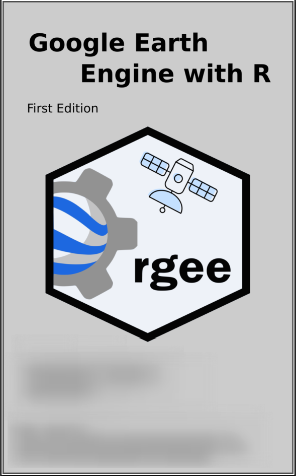

`r if (knitr::is_latex_output()) '<!--'` 

# Welcome {-}

  __"[rgee](https://cran.r-project.org/web/packages/rgee/index.html)"__ is a binding package for calling Google Earth Engine API from within R. Additionally, several functions have been implemented to make simple the connection with the R spatial ecosystem.

Google Earth Engine is a cloud-based platform that allows users to have an easy access to a petabyte-scale archive of remote sensing data and run geospatial analysis on Google's infrastructure. Currently, Google offers support only for Python and JavaScript. rgee will fill the gap starting to provide support to R!. 

If you want to collaborate with the development and support of this package, you can enter the following link <https://www.buymeacoffee.com/csay>.

## License {-}

This work, as a whole, is licensed under a <a rel="license" href="http://creativecommons.org/licenses/by-nc-sa/4.0/">Creative Commons Attribution-NonCommercial-ShareAlike 4.0 International License</a>.

The code contained in this book is simultaneously available under the [MIT license](https://opensource.org/licenses/MIT); this means that you are free to use it in your own packages, as long as you cite the source.

## Other books {-}

You may also be interested in:

* __"[Advanced R Solutions](http://advanced-r-solutions.rbind.io)"__ by
  Malte Grosser and Henning Bumann, provides worked solutions to the exercises
  in this book.

* __"[R for Data Science](http://r4ds.had.co.nz/)"__ which introduces you to R 
  as a tool for doing data science, focussing on a consistent
  set of packages known as the tidyverse.

* __"[R Packages](http://r-pkgs.had.co.nz/)"__ which teaches you 
  how to make the most of R's fantastic package system.

`r if (knitr::is_latex_output()) '-->'`
